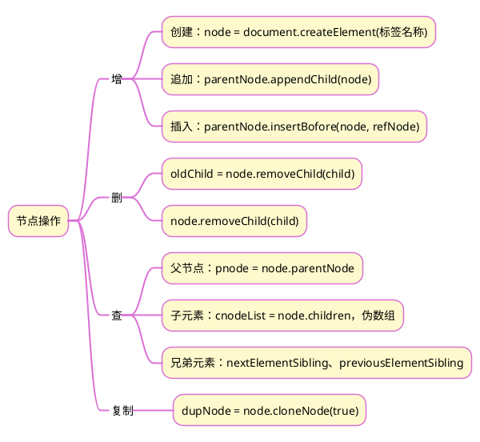

>《JavaScript 入门到精通》读书笔记之十

## 1 思维导图


## 2 案例
### 2.1 实现功能
点击子元素中的关闭按钮，可以关闭父节点。
### 2.2 解决思路
#### 2.2.1 思路1
用循环，对每一个关闭按钮注册点击事件，关闭其父节点
#### 2.2.2 思路2
用事件委托，对上层节点注册点击事件，用 if 语句判断事件源，关闭事件源的父节点
#### 2.2.3 代码

```html
<!DOCTYPE html>
<html lang="en">

<head>
    <meta charset="UTF-8">
    <meta http-equiv="X-UA-Compatible" content="IE=edge">
    <meta name="viewport" content="width=device-width, initial-scale=1.0">
    <title>Document</title>
    <style>
        .box {
            position: relative;
            width: 1000px;
            height: 200px;
            background-color: pink;
            margin: 100px auto;
            text-align: center;
            font-size: 50px;
            line-height: 200px;
            font-weight: 700;
        }

        .box1 {
            position: absolute;
            right: 20px;
            top: 10px;
            width: 20px;
            height: 20px;
            background-color: skyblue;
            text-align: center;
            line-height: 20px;
            font-size: 16px;
            cursor: pointer;
        }
    </style>
</head>

<body>
    <div class="lbox">
        <div class="box">
            我是广告1
            <div class="box1">X</div>
        </div>
        <div class="box">
            我是广告2
            <div class="box1">X</div>
        </div>
        <div class="box">
            我是广告3
            <div class="box1">X</div>
        </div>
    </div>

    <script>
	    // 循环注册点击事件
        // const box1s = document.querySelectorAll('.box1');
        // for (let i = 0; i < box1s.length; i++) {
        //     box1s[i].addEventListener('click', function () {
        //         this.parentNode.style.display = 'none'
        //     });
        // }
        
        // 事件委托
        const lbox = document.querySelector('.lbox');
        lbox.addEventListener('click', function (e) {
            if (e.target.className === 'box1') {
                e.target.parentNode.style.display = 'none';
            }
        });        
    </script>
</body>

</html>
```


