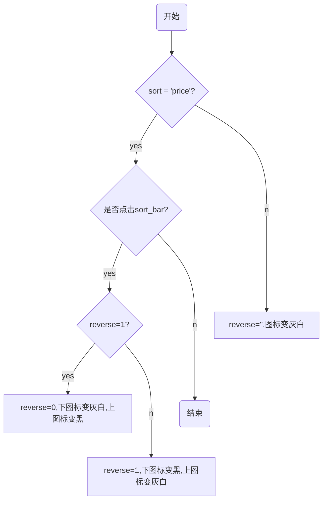

>《Python 程序语言·Django》读书笔记之七

💡 实现2个目标：    

1. 选中时颜色有变化
2. 价格有升序、降序两种，图标有变化  

## 1 选中时颜色有变化  

### 1.1 第一种方法

```js
if(data.sort){
    $("#sort_bar").find('a').each(function(index){
        if($(this).attr('sort') == data.sort){
            $(this).css('background-color','red')
        }else{
            $(this).css('background-color','')
        }
    })
}else{
    $("#sort_bar").find('a').css('background-color','')
}
```  

上述语句中，如果选中排序方式，each表示遍历到的每个a标签，如果其 sort 属性与排序方式一致，设置其颜色属性，否则不设置。如果未选中排序方式，所有 a 标签取消颜色设置。  

### 1.2 第二种方法  

```js
if(sort){
    if($(this).parent().attr("id")=='sort_bar'){
        $(this).addClass('red')
        $(this).siblings().removeClass('red')
    }
}else{
    $("#sort_bar").find('a').removeClass('red')
}
```  

第二种方法更简洁。如果sort有值，只有两种情况，一是点击sort栏，一是点击分页器。如果是点击分页器，不需要处理即可。  

### 1.3 第三种方法：  

```js
$("#sort_bar").find('a').each(function(){
    if(sort == $(this).attr('sort')){
        $(this).addClass('red')
    }else{
        $(this).removeClass('red')
    }
})
```  

## 2 价格有升序、降序两种，图标有变化  

价格升、降序，可以设置变量reverse表示，同时对图标进行 toggle。考虑到jquery的css方法返回的是rgb值，图标的toggle采用addClass和removeClass方法  

### 2.1 方法一  

```js
if($(this).attr('sort') == 'price'){
    if($(this).find('i').first().hasClass("grey_white")){
        $(this).find('i').first().removeClass('grey_white').addClass('black')
        $(this).find('i').last().removeClass('black').addClass('grey_white')
        reverse = 1
    }else{        $(this).find('i').first().removeClass('black').addClass('grey_white')      $(this).find('i').last().removeClass('grey_white').addClass('black')
        reverse = 0
    }
}else{    $("#sort_bar").find('i').filter('.fa').removeClass("black").addClass('grey_white')
}
```  

上述语句有误，当点击分页器时，不能准确传递reverse。grey_white和black是自定义颜色的两个类属性，正确语句：  

```js
 if(sort == 'price'){
    if($(this).parent().attr('id')=='sort_bar'){
        if($(this).find('i').first().hasClass('grey_white')){
            $(this).find('i').first().removeClass('grey_white').addClass('black')
            $(this).find('i').last().removeClass('black').addClass('grey_white')
            reverse = 1
        }else{            $(this).find('i').first().removeClass('black').addClass('grey_white')

            $(this).find('i').last().removeClass('grey_white').addClass('black')
            reverse = 0
        }
    }else   if($("#sort_bar").find("a").eq(1).find('i').first().has                 Class('grey_white')){
                reverse = 0
            }else{
                reverse = 1
            }
}else{
    $('#sort_bar').find('a').eq(1).find('i').removeClass('black').addClass('grey_white')
}
```  

### 2.2 方法二 

对价格排序按钮和分页器设置reverse属性  




```js
if(sort=='price'){
    if($(this).parent().attr('id')=='sort_bar'){
        if($(this).attr('reverse')==1){
            $(this).attr('reverse',0)            $(this).find('i').first().removeClass('black').addClass('grey_white')            $(this).find('i').last().removeClass('grey_white').addClass('black')
        }else{
            $(this).attr('reverse',1)            $(this).find('i').first().removeClass('grey_white').addClass('black')            $(this).find('i').last().removeClass('black').addClass('grey_white')
        }
    }
}else{
    $(".price").attr('reverse','')
    $(".price").find('i').removeClass('black').addClass('grey_white')
}
```
}
```