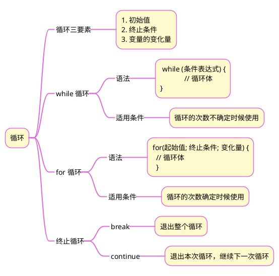
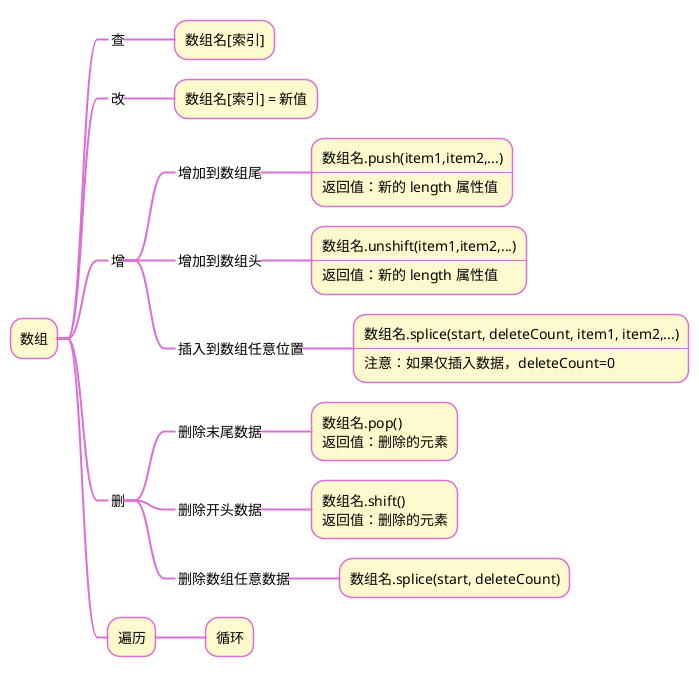

>《JavaScript 入门到精通》读书笔记之三

## 1 思维导图
### 1.1 循环


### 1.2 数组


## 2 综合案例
渲染柱状图：


利用 BootStrap 的栅格布局，标注数字和季度名称的位置则通过 position 和 margin 属性值来调整。
代码
```html
<!DOCTYPE html>
<html lang="en">
<head>
    <meta charset="UTF-8">
    <meta http-equiv="X-UA-Compatible" content="IE=edge">
    <meta name="viewport" content="width=device-width, initial-scale=1.0">
    <link rel="stylesheet" href="https://cdn.jsdelivr.net/npm/bootstrap@4.6.2/dist/css/bootstrap.min.css">
    <script src="https://cdn.jsdelivr.net/npm/jquery@3.5.1/dist/jquery.slim.min.js"></script>
    <script src="https://cdn.jsdelivr.net/npm/bootstrap@4.6.2/dist/js/bootstrap.bundle.min.js"></script>
    <title>Document</title>
    <style>
        /* 柱状图的背景色及宽度 */
        .box {
            background-color: pink;
            width: 40px;
        }
        /* 数字标注 */
        span {
            position: absolute;
            margin-top: -20px;
            margin-left: 5px;
        }
        /* 坐标轴的轴线及高度 */
        #bar {
            border-left: 1px solid black;
            border-bottom: 1px solid black;
            height: 200px;
        }
    </style>
</head>

<body>
    <div class="container mt-5">
        <div class="row align-items-end" id="bar">

        </div>
    </div> 

    <script>
        let season = [];
        let chinese = ['一', '二', '三', '四'];
        for (let i = 0; i < 4; i++) {
            let num = Number(prompt(`输入第${chinese[0]}季度：`));
            season.push(num);
        }
        let str = ``;
        for (let i = 0; i < 4; i++) {
            str += `<div class="col">
                <div class="row justify-content-center">
                    <div class="box" style="height:${season[i]}px">
                        <span>${season[i]}</span>
                        <div style="position:absolute;margin-top:${season[i]}px">第${chinese[i]}季度</div>
                    </div>
                </div>
            </div>`
        }
        document.getElementById('bar').innerHTML = str;  
    </script>
</body>
</html>
```


