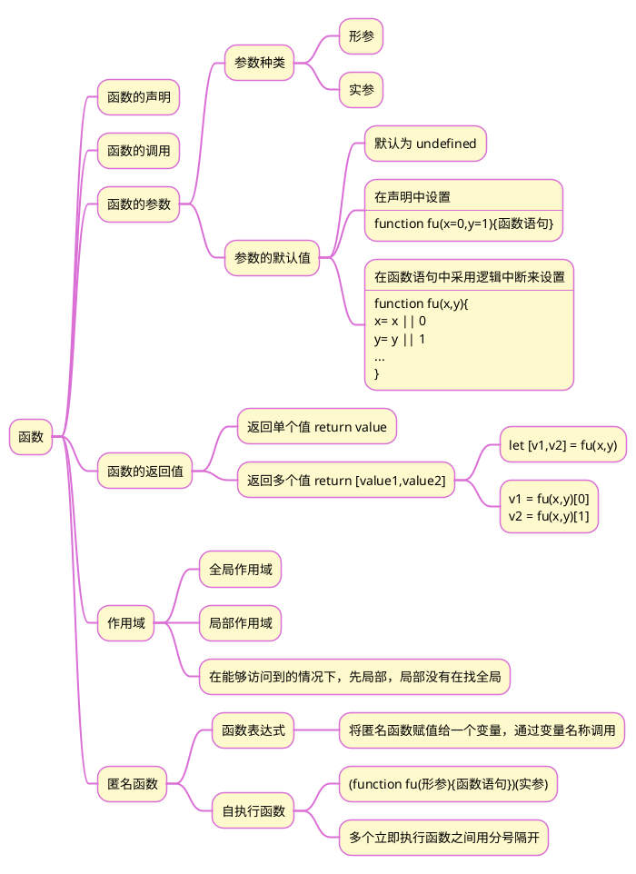

>《JavaScript 入门到精通》读书笔记之四

## 1 思维导图

```plantuml
@startmindmap Mindmap
skinparam ArrowColor orchid
skinparam ArrowThickness 2
skinparam NodeBackgroundColor lemonchiffon
skinparam NodeBorderColor orchid
* 函数
** 函数的声明
** 函数的调用
** 函数的参数
*** 参数种类
**** 形参
**** 实参
*** 参数的默认值
**** 默认为 undefined
****:在声明中设置
----
function fu(x=0,y=1){函数语句};
****:在函数语句中采用逻辑中断来设置
----
function fu(x,y){
x= x || 0
y= y || 1
...
};
** 函数的返回值
*** 返回单个值 return value
*** 返回多个值 return [value1,value2]
**** let [v1,v2] = fu(x,y)
****:v1 = fu(x,y)[0]
v2 = fu(x,y)[1];
** 作用域
*** 全局作用域
*** 局部作用域
*** 在能够访问到的情况下，先局部，局部没有在找全局
** 匿名函数
*** 函数表达式
**** 将匿名函数赋值给一个变量，通过变量名称调用
*** 自执行函数
**** (function fu(形参){函数语句})(实参)
**** 多个立即执行函数之间用分号隔开
@endmindmap
```
