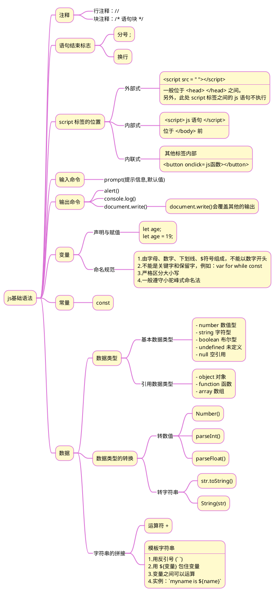

>《JavaScript 入门到精通》读书笔记之一

## 1 思维导图



## 2 案例
### 2.1 变量值的交换
#### 2.1.1 方法一，解构赋值
```js
let a = 1;
let b = 2;
[a,b] = [b,a];
// 赋值语句要以分号(;)结束，否则出错
```
#### 2.1.2 方法二，用临时变量
```js
let a = 1;
let b = 2;
let c = a;
a = b;
b = c;
```
### 2.2 计算银行卡余额案例

#### 2.2.1 题目描述 

  1、用户输入总的银行卡金额，依次输入本月花费的电费，水费，网费。  
  2、页面打印一个表格，计算出本月银行卡还剩下的余额。
#### 2.2.2 代码
##### 2.2.2.1 style.css
```css
  /* 设置表格本身及内部文本的对齐方式，设置边框线为单线 */
table {
    margin: auto;
    text-align: center;
    border-collapse: collapse;
}
/* 设置表格的边框线为实线、黑色 */
table,
th,
td {
    border: 1px solid black;
}
```

##### 2.2.2.2 script.js
```js
window.onload = init;
function init() {
    const tableHeader = `<caption><h3>2020年12月消费支出</h3></caption>
<tr>
    <th>银行卡金额</th>
    <th>电费</th>
    <th>水费</th>
    <th>网费</th>
    <th>银行卡余额</th>
</tr>`;
    let money = parseFloat(prompt('输入银行卡金额：'));
    let power = parseFloat(prompt('输入电费：'));
    let water = parseFloat(prompt('输入水费量：'));
    let net = parseFloat(prompt('输入网费：'));
    document.querySelector('table').innerHTML = `${tableHeader}
    <tr>
        <td>${money}</td>
        <td>${power}</td>
        <td>${water}</td>
        <td>${net}</td>
        <td>${money - power - water - net}</td>
    </tr>`}; 
```

##### 2.2.2.3 exam.html
```html
<!DOCTYPE html>
<html lang="en">
<head>
    <meta charset="UTF-8">
    <meta http-equiv="X-UA-Compatible" content="IE=edge">
    <meta name="viewport" content="width=device-width, initial-scale=1.0">
    <title>Document</title>
    <link rel="stylesheet" type="text/css" href="style.css">
    <script src="script.js"></script>
</head>
<body>
    <table></table>
</body>
</html>
```

>[!note]+ 知识点
>1. 表格本身的居中对齐，要使用 margin:auto
>
>2. 表格边框由双线变为单线，要使用 border-collapse: collapse
