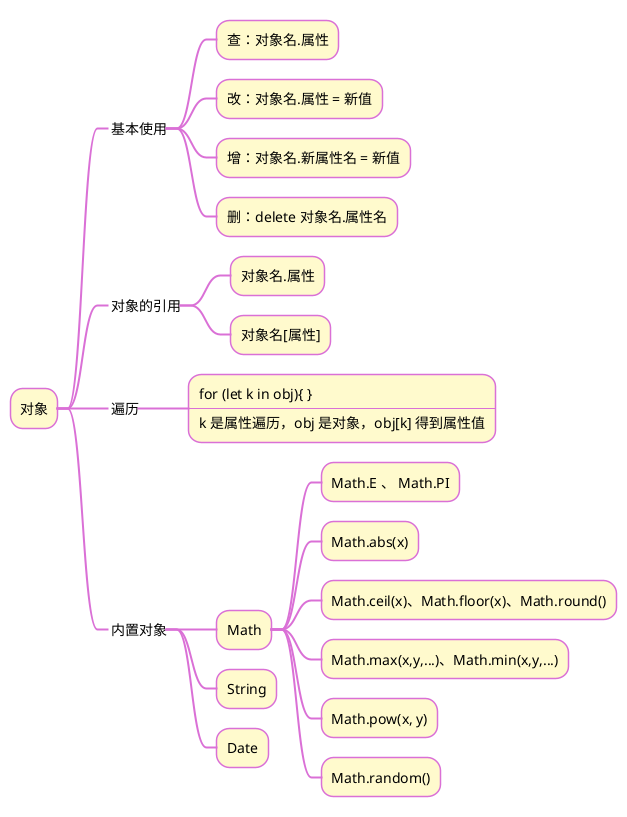

>《JavaScript 入门到精通》读书笔记之五

## 1 思维导图

```plantuml
@startmindmap Mindmap
skinparam ArrowColor orchid
skinparam ArrowThickness 2
skinparam NodeBackgroundColor lemonchiffon
skinparam NodeBorderColor orchid
* 对象
**_ 基本使用
*** 查：对象名.属性
*** 改：对象名.属性 = 新值
*** 增：对象名.新属性名 = 新值
*** 删：delete 对象名.属性名
**_ 对象的引用
*** 对象名.属性
*** 对象名[属性]
**_ 遍历
***:for (let k in obj){ }
----
k 是属性遍历，obj 是对象，obj[k] 得到属性值;
**_ 内置对象
*** Math
**** Math.E 、 Math.PI
**** Math.abs(x)
**** Math.ceil(x)、Math.floor(x)、Math.round()
**** Math.max(x,y,...)、Math.min(x,y,...)
**** Math.pow(x, y)
**** Math.random()
*** String
*** Date
@endmindmap
```

