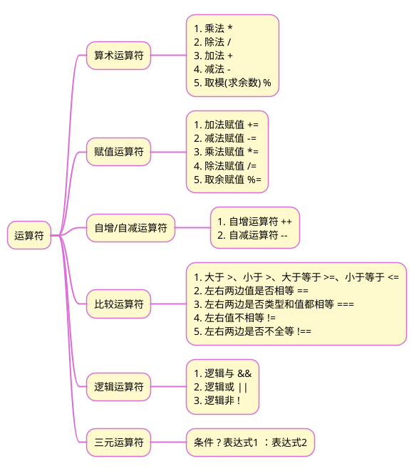

>《JavaScript 入门到精通》读书笔记之二

## 1 思维导图


## 2 分支语句
### 2.1 if 语句
```js
if(条件表达式) { 满足条件要执行的语句 }

if (条件表达式){ 
// 满足条件要执行的语句
} else { 
// 不满足条件要执行的语句
}

if (条件表达式) {
// 满足条件要执行的语句
} else if (条件表达式) { 
// 满足条件要执行的语句 
} else {
// 不满足条件要执行的语句
}
```

### 2.2 switch 语句
```js
switch (表达式) {
  case 值1: 
  // 代码1  
  break 
  case 值2: 
  // 代码2  
  break 
  // ...  
  default: 
  // 代码n 
  }
```

>[!note]+ 注意
>1.  switch case语句一般用于等值判断,必须是全等(\=\=\=)，if适合于区间判断
>2.  switch case一般需要配合break关键字使用，没有break会造成case穿透
>3.  if 多分支语句开发要比switch更重要，使用也更多