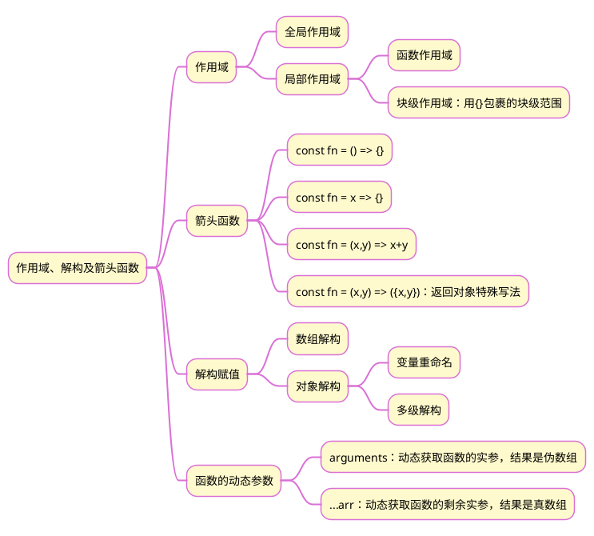

>《JavaScript 入门到精通》读书笔记之十三


## 1 思维导图


## 2 js 闭包

闭包是一种比较特殊的函数，使用闭包能够访问函数作用域中的变量。简单的讲，闭包 = 内层函数 + 外层函数的变量。

### 2.1 实例：统计函数的调用次数
```js
function count() {
	i = 0;
	function fn() {
		i++;
		return i;
	}
	return fn;
};
const res = count();
console.log(`函数调用了${res()}次`);
console.log(`函数调用了${res()}次`);
console.log(`函数调用了${res()}次`);
```

上述代码的执行流程：
1. 执行`const res = count()`语句，调用函数 count()，i 赋值 0，然后返回 fn，最后 res=fn；
2. 执行第一个 `console.log(函数调用了${res()}次)`语句，res() 表示 fn()，即对函数fn进行调用，变量 i 来自上级函数 count()的作用域，由于没有回收，此时的值为0。i 自增1，然后返回 i 的值，即1。打印结果是 "函数调用了1次"。
3. 执行第二个 `console.log(函数调用了${res()}次)`语句，res() 表示 fn()，即对函数fn进行调用，变量 i 来自上级函数 count()的作用域，由于没有回收，此时的值为1。i 自增1，然后返回 i 的值，即2。打印结果是 "函数调用了2次"。
4. 执行第三个 `console.log(函数调用了${res()}次)`语句，res() 表示 fn()，即对函数fn进行调用，变量 i 来自上级函数 count()的作用域，由于没有回收，此时的值为2。i 自增1，然后返回 i 的值，即3。打印结果是 "函数调用了3次".

## 3 数组的遍历

### 3.1 for in 循环
```js
	const arr=[1,2,3];
	for(let i=0;i<arr.length;i++){
		console.log(arr[i]);
		console.log(i)
	}
```

### 3.2 forEach循环
```js
	const arr=[1,2,3];
	arr.forEach((item,index)=>{
		console.log(item);
		console.log(index);
	});
```

### 3.3 map()方法
[语法定义]()%20方法)
```js
	const arr=[1,2,3];
	const newArr = arr.map((item,index)=>{
		console.log(item);
		console.log(index);
		return item
	});
```

{}map() 方法实际上是一种映射，对原数组中的每个元素进行相应的操作，结果作为一个新数组的元素返回。如果没有返回值，则新数组与原数组长度相同，但每个元素均为 undefined。它与 forEach 的不同之处在于有返回值—新数组，原数组保持不变。

 {}### 3.4 filter()方法
为数组中的每个元素执行回调函数，如果该函数返回真值，则将该元素保留在结果数组中，如果返回假值，则在结果数组中不保留该元素。

#### 3.4.1 语法
```js
newArr = arr.filter((item,index)=>{函数体语句})
```

#### 3.4.2 代码
```js
const arr=[1,2,3];
const newArr = arr.filter((item,index)=>{
	console.log(item);
	console.log(index);
	return item>2
});
// 结果：newArr = [3]
```

{}当 filter() 方法针对原数组的每个元素均返回 true时，结果数组与原数组一致。

 {}## 4 展开语法(`...`)
该语法只能用于可迭代对象。

### 4.1 构造字面量数组
```js
const parts = ['shoulders', 'knees'];
const lyrics = ['head', ...parts, 'and', 'toes'];
// ["head", "shoulders", "knees", "and", "toes"]
```

#### 4.1.1 实例：求最大值
```js
const arr=[1,2,3,4,5];
console.log(Math.max(...arr));
```

#### 4.1.2 实例：数组合并
```js
let arr1 = [0, 1, 2];
let arr2 = [3, 4, 5];
let arr3 = [...arr1, ...arr2];
```

### 4.2 剩余参数
剩余参数语法允许我们将一串不定数量的参数表示为一个数组。
剩余参数语法看起来和展开语法完全相同，但结果是相反的：展开语法将数组展开为其中的各个元素，而剩余语法则是将多个元素收集起来并“凝聚”为单个元素。
```js
function fn(...arr){
	for(let i=0;i<arr.length;i++){
		console.log(arr[i]);
		}
}
fn(1,2,3);
fn('a','v')
```

## 5 解构赋值
将数组中的值或对象的属性取出，赋值给其他变量

### 5.1 数组解构赋值
1. 变量的顺序对应数组单元值的位置依次进行赋值操作
2. 变量的数量大于单元值数量时，多余的变量将被赋值为  `undefined`
3. 变量的数量小于单元值数量时，可以通过剩余参数语法 `...` 获取剩余单元值，但只能置于最末位
4. 允许初始化变量的默认值，且只有单元值为 `undefined` 时默认值才会生效
```js
const arr = [1,2,3,4,5];
const [a,b=3,...c] = arr;
// 结果 a=1 b=2 c=[3,4,5]
```

### 5.2 对象解构赋值
1. 对象属性的值将被赋值给与属性名相同的变量
2. 对象中找不到与变量名一致的属性时变量值为 `undefined`
3. 允许初始化变量的默认值，属性不存在或单元值为 `undefined` 时默认值才会生效
4. 允许变量的重命名
```js
const user = {
    name: '小明',
    age: 18
  };
const {name:uname,age} = user
```

### 5.3 实例：两数交换
```js
function exchange(a,b){
	[a,b] = [b,a];
	return [a,b]
}
```

## 6 综合实例
### 6.1 功能
设置两种单选框，一是pay_type，一是hero_type，选择后，会进行筛选过滤，然后将得到的结果渲染。

### 6.2 代码
```html
<!DOCTYPE html>
<html lang="en">

<head>
    <meta charset="UTF-8">
    <meta http-equiv="X-UA-Compatible" content="IE=edge">
    <meta name="viewport" content="width=device-width, initial-scale=1.0">
    <title>Document</title>    
    <style>
        .nav {
            width: 1200px;
            height: 120px;
            background-color: #eee;
            margin-top: 100px;
            margin-left: auto;
            margin-right: auto;
            display: flex;
        }

        .nav .left {
            width: 40px;
            background-color: rgb(84, 84, 211);
            color: white;
            padding-left: 22px;
            padding-right: 20px;
            line-height: 55px;
            display: flex;
            flex-wrap: wrap
        }

        .box {
            width: 95%;
            margin-top: 50px;
            margin-right: auto;
            margin-left: auto;
            border: 2px solid black;
            display: flex;
            flex-wrap: wrap;
        }

        .pic {
            /* border: 2px solid blue; */
            width: 90px;
            padding: 13px;
        }

        .pic .name {
            text-align: center;
        }
    </style>
</head>

<body>
    <div class="nav">
        <div class="left">综合定位</div>
        <div class="right">
            <div class="pay">
                <label for="one"><input type="radio" name="pay-type" id="one" data-type="p10">本周免费</label>
                <label for=""><input type="radio" name="pay-type" data-type="p1">新手推荐</label>
            </div>
            </br>
            <div class="hero">
                <label for=""><input type="radio" name="hero-type" data-type="h0">全部</label>
                <label for=""><input type="radio" name="hero-type" data-type="h1">坦克</label>
                <label for=""><input type="radio" name="hero-type" data-type="h2">战士</label>
                <label for=""><input type="radio" name="hero-type" data-type="h3">刺客</label>
                <label for=""><input type="radio" name="hero-type" data-type="h4">法师</label>
                <label for=""><input type="radio" name="hero-type" data-type="h5">射手</label>
                <label for=""><input type="radio" name="hero-type" data-type="h6">辅助</label>
            </div>

        </div>
    </div>
    <div class="box">

    </div>
    <script>
			    /* 
		pay_type :  10 本周免费  1 新手推荐
		hero_type : 3:坦克  1:战士  4:刺客  2:法师   5:射手   6:辅助
		*/
		const heroArr = [{
			    "icon": "./images/105.jpg",
			    "name": "廉颇",
			    "pay_type": 10,
			    "hero_type": 3,
			}, {
			    "icon": "./images/106.jpg",
			    "name": "小乔",
			    "hero_type": 2,
			    "pay_type": 1
			}, {
			    "icon": "./images/107.jpg",
			    "name": "赵云",
			    "hero_type": 1,
			    "pay_type": 1
			}, {
			    "icon": "./images/108.jpg",
			    "name": "墨子",
			    "hero_type": 2,
			    "pay_type": 1
			}, {
			    "icon": "./images/109.jpg",
			    "name": "妲己",
			    "pay_type": 1,
			    "hero_type": 2,
		}]
        const right = document.querySelector('.right');
        let payType = 0;
        let heroType = 0;
        right.addEventListener('click', ev => {
            if (ev.target.tagName === 'INPUT') {
                const { dataset: { type } } = ev.target
                if (type.startsWith('h')) {
                    heroType = +type.slice(1);
                } else if (type.startsWith('p')) {
                    payType = +type.slice(1);
                }
            };
            heroFilter = heroArr.filter(item => (payType === 0 || payType === item.pay_type) && (heroType === 0 || heroType === item.hero_type)
            );
            render(heroFilter);
        });

        function render(arr) {
            const newArr = arr.map(item => {
                const { icon, name } = item;
                return `<div class="pic">
                            
                            <div class="name">${name}</div>
                        </div>`
            });
            document.querySelector('.box').innerHTML = newArr.join('');
        };
        render(heroArr)
    </script>
</body>

</html>
```

### 6.3 涉及到的知识点
1. label 标签中的 for 属性设置为与 input 标签的 id 相同，可以实现二者的关联。
2. `heroFilter = heroArr.filter(item => (payType === 0 || payType === item.pay_type) && (heroType === 0 || heroType === item.hero_type))`，条件语句的嵌套。需要对每条数据判断两个属性(`pay_type`、`hero_type`)是否同时满足，满足即进入结果数组，不满足即不进入。
	1. `pay_type`属性的过滤筛选。当`payType = 0`时表示全选，即每条数据的`pay_type`属性的过滤结果均为 true。当`pay_type`不为0时，要根据`payType === item.pay_type`的结果来返回每条数据的`pay_type`属性的过滤筛选结果。因此用逻辑或。
	2. `hero_type`属性的过滤筛选。与`pay_type`属性的过滤筛选类似。
