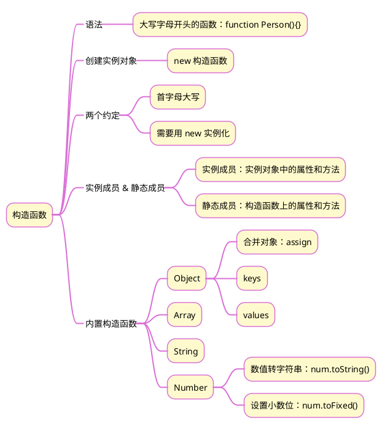

>《JavaScript 入门到精通》读书笔记之十五

## 1 思维导图

```plantuml
@startmindmap Mindmap
skinparam ArrowColor orchid
skinparam ArrowThickness 2
skinparam NodeBackgroundColor lemonchiffon
skinparam NodeBorderColor orchid
* 构造函数
**_ 语法
*** 大写字母开头的函数：function Person(){}
**_ 创建实例对象
*** new 构造函数
**_ 两个约定
*** 首字母大写
*** 需要用 new 实例化
**_ 实例成员 & 静态成员
*** 实例成员：实例对象中的属性和方法
*** 静态成员：构造函数上的属性和方法
**_ 内置构造函数
*** Object
**** 合并对象：assign
**** keys
**** values
*** Array
*** String
*** Number
**** 数值转字符串：num.toString()
**** 设置小数位：num.toFixed()
@endmindmap
```

