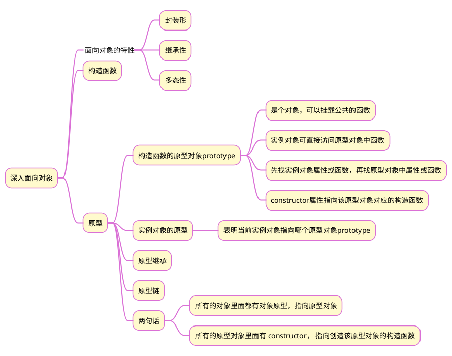

>《JavaScript 入门到精通》读书笔记之十六


## 1 思维导图


## 2 原型对象  

构造函数通过原型分配的函数是所有对象共享的。  

- JavaScript 规定，每一个构造函数都有一个 prototype 属性，指向另一个对象，所以我们也称为原型对象

- 这个对象可以挂载函数，对象实例化不会多次创建原型上的函数，节约内存

- 我们可以把那些不变的方法，直接定义在 prototype 对象上，这样所有对象的实例就可以共享这些方法。

- 构造函数和原型对象中的this 都指向实例化的对象

- 每个原型对象里面都有个constructor 属性（constructor 构造函数），该属性指向该原型对象的构造函数

## 3 对象原型

对象都会有一个属性 `__proto__` 指向构造函数的 prototype 原型对象，之所以我们对象可以使用构造函数 prototype 

原型对象的属性和方法，就是因为对象有 `__proto__` 原型的存在。

注意：

- `__proto__` 是JS非标准属性
- `[[prototype]]`和`__proto__`意义相同
- 用来表明当前实例对象指向哪个原型对象prototype
- `__proto__`对象原型里面也有一个 constructor属性，指向创建该实例对象的构造函数

## 4 原型继承
```js
function Person(){
	this.eyes=2;
	this.head=1;
};
function Man(){
	this.gender='male';
};
Man.prototype=new Person();
Man.prototype.constructor=Man
```

上述代码中，构造函数 Man() 继承了构造函数 Person() 的属性和方法，当创建 Man() 的一个实例对象时，该对象既拥有函数 Man() 的属性和方法，也拥有函数 Person() 的属性和方法。


## 5 原型链


- 当访问一个对象的属性（包括方法）时，首先查找这个对象自身有没有该属性。

- 如果没有就查找它的原型（也就是 `__proto__`指向的 prototype 原型对象）

- 如果还没有就查找原型对象的原型

- 依此类推一直找到 Object 为止（null）

- `__proto__`对象原型的意义就在于为对象成员查找机制提供一个方向，或者说一条路线

- 可以使用 `instanceof` 运算符用于检测构造函数的 prototype 属性是否出现在某个实例对象的原型链上

## 6 示例
### 6.1 示例1：给数组构造函数添加求最大值和求和方法
```js
Array.prototype.max=function(){
	return Math.max(...this)
};

Array.prototype.sum=function(){
	return this.reduce((pre,current)=>pre+current,0)
};
```

### 6.2 示例2：模拟弹出框
```html
<body>
    <button id="del">删除</button>
    <button id="login">登录</button>
    <script>
	    // 构造函数
        function Modal(title = '', message = '') {
            this.modalBox = document.createElement('div');
            this.modalBox.className = 'modal';
            this.modalBox.innerHTML = `
            <div class="title">${title}<i>×</i></div>
            <div class="message">${message}</div>`
        };
        Modal.prototype.open = function () {
            const modalBox = document.querySelector('.modal');
            // 如果已有弹出框，则移除，没有就添加
            modalBox && modalBox.remove();
            document.body.append(this.modalBox);
            // 针对弹出框的关闭按钮的点击事件。由于箭头函数没有this，此处的this表示上一级，即实例对象。
            this.modalBox.querySelector('i').addEventListener('click', () => this.modalBox.remove());
        };
        // 按钮点击事件
        const delBtn = document.querySelector('#del');
        delBtn.addEventListener('click', () => {
            const box = new Modal('温馨提示', '没有权限');
            box.open();
        });

        const loginBtn = document.querySelector('#login');
        loginBtn.addEventListener('click', () => {
            const box = new Modal('提示', '没有注册');
            box.open();
        });
    </script>
</body>
```