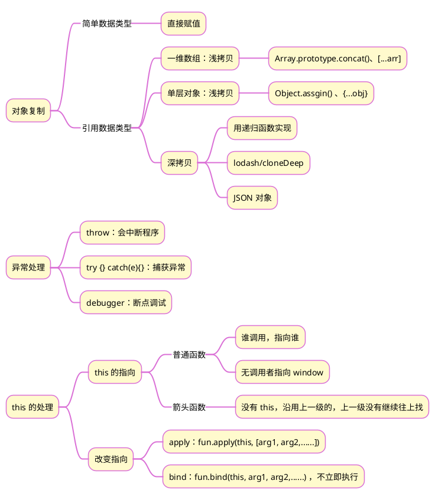

>《JavaScript 入门到精通》读书笔记之十七


## 1 思维导图



## 2 深拷贝(JSON 方法)

第一步：JSON.stringify(obj)，将 js 对象转换为 JSON 字符串；
第二步：JSON.parse(str)，将 JSON 字符串转换为 js 对象
```js
const obj = {
	name:'tom',
	family:{
		baby:'Marry'
	},
	color:['red','black'],
}
const newObj = JSON.parse(JSON.stringify(obj))
```

## 3 this 的处理示例
下面代码实现的功能：点击 button 按钮后，该按钮不可用，2秒种后恢复可用。
```html
<button>点击</button>
<script>
	const btn = document.querySelector('button');
	btn.addEventListener('click', function () {
		this.disabled = true;
		setTimeout(function(){                
			this.disabled = false
		}.bind(this), 2000);
	});
</script>
```

- 第一个 this，指向 btn 按钮
- 第二个 this，原本指向 window，由于 bind()方法修改了指向，因此指向 btn 按钮
- 第三个 this，由于依然在 btn 按钮点击事件的回调函数的语句中，因此与第一个 this 指向相同

>[!note]+ 提示
>bind() 方法可以接在函数名的后面，也可以接在匿名函数 function(){} 的后面