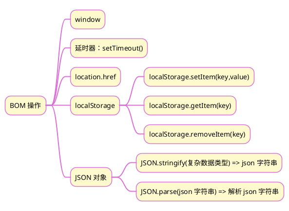

>《JavaScript 入门到精通》读书笔记之十一


## 1 思维导图


## 2 延时器函数：setTimeout() 和clearTimeout()
设置一个定时器，在定时器到期后执行一个函数。clearTimeout()则是清除定时器。

### 2.1 语法
```js
const timeID = setTimeout(functionRef, delay)
clearTimeout(timeID)
```

### 2.2 参数
1. functionRef：当定时器到期后，将要执行的 function。
2. delay 可选：等待的时间，单位是毫秒。

### 2.3 返回值
返回值 timeoutID 是一个正整数，表示由 `setTimeout()` 调用创建的定时器的编号。这个值可以传递给 clearTimeout() 来取消该定时器。

## 3 JSON 对象
JSON 对象包含两个方法：用于解析 JSON 字符串的 parse() 方法，以及将对象/值转换为 JSON 字符串的 stringify() 方法。除了这两个方法，JSON 这个对象本身并没有其他作用，也不能被调用或者作为构造函数调用。

### 3.1 JSON.parse() 方法
解析 JSON 字符串，构造由字符串描述的 JavaScript 值或对象。

#### 3.1.1 语法
`JSON.parse(text)`

#### 3.1.2 参数
text：要被解析成 JavaScript 值的字符串。

#### 3.1.3 返回值
Object 类型，对应给定 JSON 文本的对象/值。

### 3.2 JSON.stringify() 方法
将一个 JavaScript 对象或值转换为 JSON 字符串

#### 3.2.1 语法
`JSON.stringify(value)`

#### 3.2.2 参数
value：将要序列化成一个 JSON 字符串的值

#### 3.2.3 返回值
一个表示给定值的 JSON 字符串

## 4 map()、join() 和 split() 方法

### 4.1 map() 方法
创建一个新数组，这个新数组由原数组中的每个元素都调用一次提供的函数后的返回值组成。

#### 4.1.1 语法
`newArr = array.map(function(ele,index){ 函数体语句 });`

#### 4.1.2 参数
1. ele：数组中的元素。
2. index：正在处理的元素在数组中的索引。
3. array：调用了 map() 的数组本身。

#### 4.1.3 返回值
一个新数组，每个元素都是回调函数的返回值。

### 4.2 join() 方法
将数组的所有元素连接成一个字符串并返回这个字符串

#### 4.2.1 语法
`str = array.join(separator)`

#### 4.2.2 参数
1. array：需要处理的数组
2. separator：可选，指定一个字符串来分隔数组的每个元素，默认 ","

#### 4.2.3 返回值
一个所有数组元素连接的字符串。如果 arr.length 为 0，则返回空字符串

### 4.3 split() 方法
使用指定的分隔符将一个 String 对象分割成字符串数组。与 join() 方法可逆。

#### 4.3.1 语法
`str.split(separator)`

#### 4.3.2 参数
separator：指定表示每个拆分应发生的点的字符串。separator 可以是一个字符串或正则表达式。

#### 4.3.3 返回值
源字符串以分隔符出现位置分隔而成的一个 Array

## 5 案例：信息统计表
### 5.1 功能
1. 打开浏览器后，显示已有的信息
2. 表单录入信息后，存入浏览器，同时在表格中显示
3. 表格中每行有删除按钮，点击后会删除该行数据

### 5.2 解决思路

1. 打开浏览器后，清空其他数据
2. 读取浏览器中的已有信息，形成数组，然后渲染到 table 中。
3. 针对表单，注册 submit 事件，提取输入框的数据，形成对象。
4. 将该对象渲染成一行，追加到 table 中。
5. 将该对象存入数组，将数组存入浏览器，最后重置表单。
6. 注册删除按钮的点击事件，删除该按钮元素的爷爷节点。
7. 通过该按钮的爷爷节点 rowindex 属性，删除数组中的相应项
8. 更新浏览器中的信息。

### 5.3 代码
```html
<!DOCTYPE html>
<html lang="en">

<head>
    <meta charset="UTF-8">
    <meta http-equiv="X-UA-Compatible" content="IE=edge">
    <meta name="viewport" content="width=device-width, initial-scale=1.0">
    <link rel="stylesheet" href="https://cdnjs.cloudflare.com/ajax/libs/font-awesome/4.7.0/css/font-awesome.min.css">
    <title>Document</title>
    <style>
        .box {
            width: 800px;
            margin: auto;
            text-align: center;
        }

        input,
        select {
            width: 120px;
            border: 1px solid skyblue;
            outline: none;
            font-size: 102%;
        }

        .submit {
            background-color: rgb(111, 111, 160);
            width: 80px;
            color: white;
            font-size: 102%;
            cursor: pointer;
        }

        .message {
            background-color: #cccbcb;
            text-align: end;
            margin-top: 50px;
            height: 50px;
            line-height: 50px;
            padding-right: 10px;
        }

        .dataCount {
            color: red;
            margin: 5px;
        }

        table {
            border-collapse: collapse;
            padding-left: 5px;
            width: 800px;
            margin-top: 10px;
        }

        th {
            font-weight: bold;
            background-color: #cccbcb;
        }

        table,
        th,
        td {
            border: 1px solid black;
        }

        tr {
            height: 50px;
        }

        .trash {
            border: none;
            color: white;
            width: 80px;
            height: 30px;
            background-color: rgba(177, 56, 130, 0.541);
            cursor: pointer;
        }
    </style>
</head>

<body>
    <div class="box">
        <h1>学生就业信息统计表</h1>
        <form action="#" class="info" autocomplete="off">
            <input type="text" placeholder="姓名" id="uname">
            <input type="text" placeholder="年龄" id="age">
            <input type="text" placeholder="薪资" id="salary">
            <select name="" id="gender">
                <option value="男">男</option>
                <option value="女">女</option>
            </select>
            <select name="" id="city" value="北京">
                <option value="北京">北京</option>
                <option value="上海">上海</option>
                <option value="广州">广州</option>
                <option value="深圳">深圳</option>
            </select>
            <button type="submit" class="submit"><i class="fa fa-plus-circle"></i> 添加</button>
        </form>
        <div class="message">共有数据<span class="dataCount">0</span>条</div>
        <table>
            <tr>
                <th>ID</th>
                <th>姓名</th>
                <th>年龄</th>
                <th>性别</th>
                <th>薪资</th>
                <th>就业城市</th>
                <th>录入时间</th>
                <th>操作</th>
            </tr>
        </table>
    </div>
    <script>
        const submit = document.querySelector('.submit');
        const dataCount = document.querySelector('.dataCount');
        const table = document.querySelector('table');
        const info = document.querySelector('.info');
        const arr = JSON.parse(localStorage.getItem('data')) || [];

        /* 立即执行函数，初始化表格数据 */
        (function () {
            const flag = localStorage.getItem('reset');
            if (!flag) {
                localStorage.clear();
                localStorage.setItem('reset', 'true')
            }
            if (arr) {
                for (let i = 0; i < arr.length; i++) {
                    render(arr[i]);
                }
                dataCount.innerHTML = arr.length;
            }
        })();

        /* 表单注册提交事件 */
        info.addEventListener('submit', function (event) {
            const obj = {};
            const uname = document.querySelector('#uname');
            const age = document.querySelector('#age');
            const salary = document.querySelector('#salary');
            const gender = document.querySelector('#gender');
            const city = document.querySelector('#city');
            if (uname.value && age.value && salary.value) {

                /* 日期格式化 */
                const date = new Date();
                const year = date.getFullYear();
                const month = date.getMonth() + 1;
                const day = date.getDate();
                let hours = date.getHours();
                hours = hours < 10 ? '0' + hours : hours;
                let minutes = date.getMinutes();
                minutes = minutes < 10 ? '0' + minutes : minutes;
                let seconds = date.getSeconds();
                seconds = seconds < 10 ? '0' + seconds : seconds;

                /* 获取表单中的信息 */
                obj.ID = arr.length === 0 ? 1 : arr[arr.length - 1].ID + 1;
                obj.uname = uname.value;
                obj.age = age.value;
                obj.salary = salary.value;
                obj.gender = gender.value;
                obj.city = city.value;
                obj.date = `${year}/${month}/${day} ${hours}:${minutes}:${seconds}`;

                /* 数据存储 */
                arr.push(obj);
                localStorage.setItem('data', JSON.stringify(arr));

                /* 数据展示 */
                dataCount.innerHTML = arr.length;
                render(obj);

                /* 清空表单 */
                this.reset();
            } else {
                event.preventDefault();
                alert('内容不能为空');
            }
        });

        /* 渲染表格中的一行 */
        function render(obj) {
            const row = `<td>${obj.ID}</td>
                            <td>${obj.uname}</td>
                            <td>${obj.age}</td>
                            <td>${obj.gender}</td>
                            <td>${obj.salary}</td>
                            <td>${obj.city}</td>
                            <td>${obj.date}</td>
                            <td><button class="trash"><i class="fa fa-trash"></i> 删除</button></td>`;
            const tr = document.createElement('tr');
            tr.innerHTML = row;
            table.appendChild(tr);
        };

        /* 表格行中的删除按钮监听事件，表格节点的事件委托*/
        table.addEventListener('click', function (event) {
            if (event.target.className === "trash") {
                table.removeChild(event.target.parentNode.parentNode);
                arr.splice(event.target.parentNode.parentNode.rowIndex - 1, 1)
                dataCount.innerHTML = arr.length;
                localStorage.setItem('data', JSON.stringify(arr));
            }
        });
    </script>

</body>

</html>
```

### 5.4 涉及到的知识点
1. `const arr = JSON.parse(localStorage.getItem('data')) || []`，读取浏览器存储，并解析为数值。如果没有数据可以避免 arr =null 
2. 立即执行函数的应用，用来初始化表格数据
3.  表单的 submit 事件以及表单的 reset() 方法
4. `event.preventDefault()`，如果不能满足条件，即阻止 submit 事件的默认行为
5. `localStorage.setItem('data', JSON.stringify(arr))`，将数据格式转换为 json 字符串，并存储到浏览器中，如果已有数据 data，则进行更新
6. `obj.ID = arr.length === 0 ? 1 : arr[arr.length - 1].ID + 1`，这是一种自动编号的方法，从 1 开始。
7. table tr 的 rowIndex 属性返回某一行在表格的行集合中的位置，第一行的值为 1。
8. `table.removeChild(event.target.parentNode.parentNode)`，移除 table 标签的一个子元素
9. `arr.splice(event.target.parentNode.parentNode.rowIndex - 1, 1)`，移除数值中的一个元素
