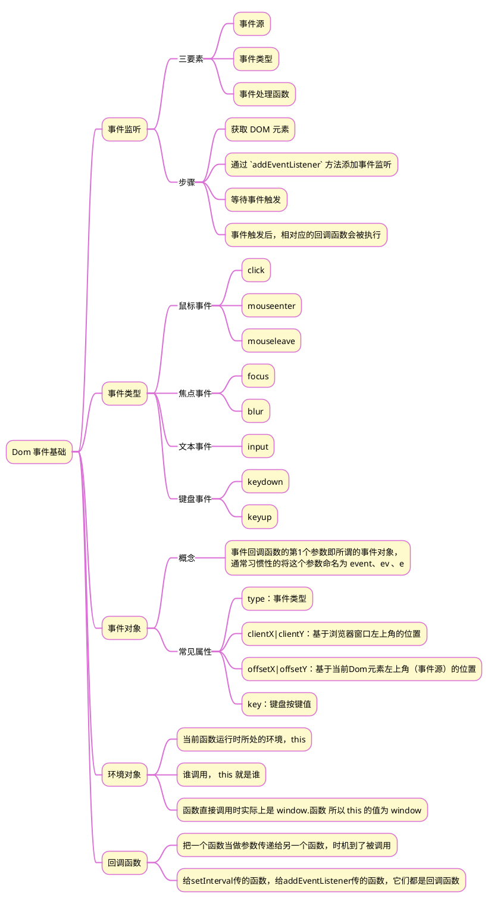

>《JavaScript 入门到精通》读书笔记之七


## 1 思维导图


## 2 轮播图
```html
<!DOCTYPE html>
<html lang="en">
<head>
  <meta charset="UTF-8" />
  <meta http-equiv="X-UA-Compatible" content="IE=edge" />
  <meta name="viewport" content="width=device-width, initial-scale=1.0" />
  <title>轮播图点击切换</title>
  <style>
    * {
      box-sizing: border-box;
    }
    .slider {
      width: 560px;
      height: 400px;
      overflow: hidden;
    }
    .slider-wrapper {
      width: 100%;
      height: 320px;
    }
    .slider-wrapper img {
      width: 100%;
      height: 100%;
      display: block;
    }
    .slider-footer {
      height: 80px;
      background-color: rgb(100, 67, 68);
      padding: 12px 12px 0 12px;
      position: relative;
    }
    .slider-footer .toggle {
      position: absolute;
      right: 0;
      top: 12px;
      display: flex;
    }
    .slider-footer .toggle button {
      margin-right: 12px;
      width: 28px;
      height: 28px;
      appearance: none;
      border: none;
      background: rgba(255, 255, 255, 0.1);
      color: #fff;
      border-radius: 4px;
      cursor: pointer;
    }
    .slider-footer .toggle button:hover {
      background: rgba(255, 255, 255, 0.2);
    }
    .slider-footer p {
      margin: 0;
      color: #fff;
      font-size: 18px;
      margin-bottom: 10px;
    }
    .slider-indicator {
      margin: 0;
      padding: 0;
      list-style: none;
      display: flex;
      align-items: center;
    }
    .slider-indicator li {
      width: 8px;
      height: 8px;
      margin: 4px;
      border-radius: 50%;
      background: #fff;
      opacity: 0.4;
      cursor: pointer;
    }
    .slider-indicator li.active {
      width: 12px;
      height: 12px;
      opacity: 1;
    }
  </style>
</head>
<body>
  <div class="slider">
    <div class="slider-wrapper">
      
    </div>
    <div class="slider-footer">
      <p>对人类来说会不会太超前了？</p>
      <ul class="slider-indicator">
        <li class="active"></li>
        <li></li>
        <li></li>
        <li></li>
        <li></li>
        <li></li>
        <li></li>
        <li></li>
      </ul>
      <div class="toggle">
        <button class="prev">&lt;</button>
        <button class="next">&gt;</button>
      </div>
    </div>
  </div>
  <script>
    // 1. 初始数据
    const data = [
      { url: './images/slider01.jpg', title: '对人类来说会不会太超前了？', color: 'rgb(100, 67, 68)' },
      { url: './images/slider02.jpg', title: '开启剑与雪的黑暗传说！', color: 'rgb(43, 35, 26)' },
      { url: './images/slider03.jpg', title: '真正的jo厨出现了！', color: 'rgb(36, 31, 33)' },
      { url: './images/slider04.jpg', title: '李玉刚：让世界通过B站看到东方大国文化', color: 'rgb(139, 98, 66)' },
      { url: './images/slider05.jpg', title: '快来分享你的寒假日常吧~', color: 'rgb(67, 90, 92)' },
      { url: './images/slider06.jpg', title: '哔哩哔哩小年YEAH', color: 'rgb(166, 131, 143)' },
      { url: './images/slider07.jpg', title: '一站式解决你的电脑配置问题！！！', color: 'rgb(53, 29, 25)' },
      { url: './images/slider08.jpg', title: '谁不想和小猫咪贴贴呢！', color: 'rgb(99, 72, 114)' },
    ]
    // 获取元素
    const img = document.querySelector('.slider-wrapper img')
    const p = document.querySelector('.slider-footer p')
    const footer = document.querySelector('.slider-footer')
    // 1. 右按钮业务
    // 1.1 获取右侧按钮
    const next = document.querySelector('.next')
    let i = 0  // 信号量 控制播放图片张数
    // 1.2 注册点击事件
    next.addEventListener('click', function () {      
      i++
      i = i >= data.length ? 0 : i
      toggle()
    })
    // 2. 左侧按钮业务
    // 2.1 获取左侧按钮
    const prev = document.querySelector('.prev')
    // 1.2 注册点击事件
    prev.addEventListener('click', function () {
      i--
      i = i < 0 ? data.length - 1 : i      
      toggle()
    })
    // 声明一个渲染的函数作为复用
    function toggle() {
      // 1.4 渲染对应的数据
      img.src = data[i].url
      p.innerHTML = data[i].title
      footer.style.backgroundColor = data[i].color
      // 1.5 更换小圆点    先移除原来的类名， 当前li再添加 这个类名
      document.querySelector('.slider-indicator .active').classList.remove('active')
      document.querySelector(`.slider-indicator li:nth-child(${i + 1})`).classList.add('active')
    }
    // 3. 自动播放模块
    let timerId = setInterval(function () {
      // 利用js自动调用点击事件  click()  一定加小括号调用函数
      next.click()
    }, 1000)
    // 4. 鼠标经过大盒子，停止定时器
    const slider = document.querySelector('.slider')
    // 注册事件
    slider.addEventListener('mouseenter', function () {
      // 停止定时器
      clearInterval(timerId)
    })
    // 5. 鼠标离开大盒子，开启定时器
    // 注册事件
    slider.addEventListener('mouseleave', function () {
      // 停止定时器
      if (timerId) clearInterval(timerId)
      // 开启定时器
      timerId = setInterval(function () {
        // 利用js自动调用点击事件  click()  一定加小括号调用函数
        next.click()
      }, 1000)
    })
  </script>
</body>
</html>
```


## 3 tab 栏案例
{}tab 栏切换时，相应产品页的显示有两种途径：
1. 所有产品的数据统一放在变量里，通过改变 src 的属性值来显示不同的产品
2. 所有产品页均在 html 代码中，通过 active 类的切换来显示。下面的代码中的注释掉的内容即是这个实现。

 {}```html
<!DOCTYPE html>
<html lang="en">
<head>
    <meta charset="UTF-8">
    <meta http-equiv="X-UA-Compatible" content="IE=edge">
    <meta name="viewport" content="width=device-width, initial-scale=1.0">
    <title>Document</title>
    <style>
        .box {
            width: 1010px;
            height: 400px;
            margin-left: 200px;
            margin-top: 100px;
        }
        .nav {
            width: 420px;
            border: 1px solid black;
        }
        ul {
            display: flex;
            list-style: none;
        }
        li {
            margin: 5px;
        }
        a {
            text-decoration: none;
            color: black;
        }
        a.active {
            border-top: 2px solid red;
            color: red;
        }
        .product {
            border: 1px solid skyblue;
        }
        .product .main {
            display: none
        }
        .product .active {
            display: block;
        }
    </style>
</head>
<body>
    <div class="box">
        <div class="nav">
            <ul>
                <li><a href="javascript:;" class="active">国际大牌</a></li>
                <li>|</li>
                <li><a href="javascript:;">国妆名牌</a></li>
                <li>|</li>
                <li><a href="javascript:;">清洁用品</a></li>
                <li>|</li>
                <li><a href="javascript:;">男士精品</a></li>
            </ul>
        </div>
        <div class="product">
            <div class="main active">
                <a href="###"></a>
            </div>
            <!-- <div class="main">
                <a href="###"></a>
            </div>
            <div class="main">
                <a href="###"></a>
            </div>
            <div class="main">
                <a href="###"></a>
            </div> -->
        </div>
    </div>
    <script>
        const imgs = [
            { url: './07-作业/tab栏案例/imgs/guojidapai.jpg' },
            { url: './07-作业/tab栏案例/imgs/guozhuangmingpin.jpg' },
            { url: './07-作业/tab栏案例/imgs/qingjieyongpin.jpg' },
            { url: './07-作业/tab栏案例/imgs/nanshijingpin.jpg' }
        ]
        const as = document.querySelectorAll('.nav a');
        const img = document.querySelector('img');
        for (let i = 0; i < as.length; i++) {
            as[i].addEventListener('mouseenter', function () {
                document.querySelector('.nav a.active').classList.remove('active');
                this.classList.add('active');
                // document.querySelector('.product div.active').classList.remove('active');
                // document.querySelector(`.product div:nth-child(${i + 1})`).classList.add('active');
                img.src = imgs[i].url;
            });
        }
    </script>
</body>
</html>
```