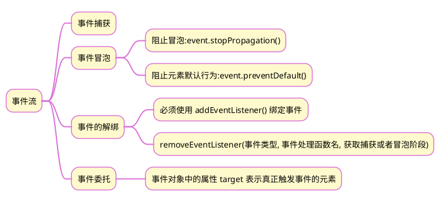
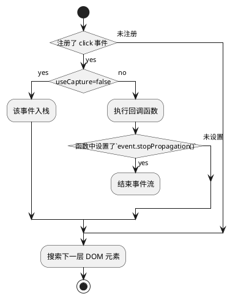
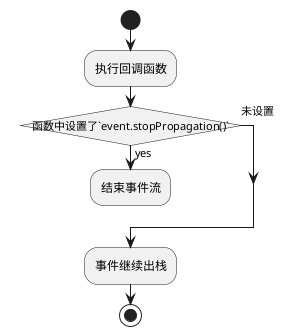

>《JavaScript 入门到精通》读书笔记之八

## 1 思维导图



## 2 事件流、事件捕获和事件冒泡

### 2.1 前提
1. DOM 元素有嵌套。当然，所有的 DOM 元素都至少嵌套在 document 元素里。
2. 嵌套的元素都有同一个事件类型。

### 2.2 事件流概念


### 2.3 事件流的设定
通过事件监听函数：
`addEventListener(type, listener, useCapture)`
该函数中，参数 `useCapture` 类型为 Boolean，默认为 `false`，表示在冒泡阶段执行。如果为 `true`，表示在捕获阶段执行。

### 2.4 事件流的终止
`event.stopPropagation()`

### 2.5 事件执行顺序

#### 2.5.1 捕获阶段

以 `click` 事件为例，当事件发生时，嵌套 DOM 元素中的最上层为目标元素。浏览器从 document 元素开始，沿 DOM 树向下搜索目标元素，沿途经过的 DOM 元素均执行以下操作：



#### 2.5.2 冒泡阶段
浏览器搜索到目标元素后，沿 DOM 树向 document 元素冒泡，实际上是依次事件出栈，执行以下操作：



### 2.6 事件委托

事件冒泡的一个重要应用就是事件委托。当需要对大量重复项注册事件时，有两种方法：
1. 利用 for 循环语句，针对重复项的每一项，注册事件。
2. 对这些重复项的父元素注册事件，当事件发生时，利用 event.target 属性找到事件源。

第一种方法比较耗费性能，尤其是重复项的数量较多时。而第二种方法的效率则高得多，当对这些重复项加上自定义属性的标识后，可以实现类似 jquery 的操作元素组。

实例：有多个 p 标签，当点击每个 p 标签时，该标签字体颜色变化

```html
<html>
<body>
    <p data-id="0">This is a paragraph.</p>
    <p data-id="1">This is another paragraph.</p>
    <p data-id="2">This is third paragraph.</p>
    <script>
	    /* 方法一，事件委托 */
        const ps = document.querySelectorAll('p');
        document.addEventListener('click', function (e) {
            if (e.target.tagName === 'P') {
                ps[+e.target.dataset.id].style.color = 'red';
            }
        })
        /* 方法二，jquery */
        $(document).ready(function(){
		  $("p").click(function(){
		    $(this).css("color","red");
		  });
		});
    </script>
</body>
</html>
```

{}由于方法二需要引入 jquery，其运行效率没有方法一高。

 {}## 3 全选按钮实例
### 3.1 解决方法一，针对每个按钮注册点击事件
```html
<!DOCTYPE html>
<html lang="en">
<head>
    <meta charset="UTF-8">
    <meta http-equiv="X-UA-Compatible" content="IE=edge">
    <meta name="viewport" content="width=device-width, initial-scale=1.0">
    <title>Document</title>
    <style>
        table {
            margin: 100px auto;
            width: 600px;
            border-collapse: collapse;
            text-align: center;
        }
        table,
        td,
        th {
            border: 1px solid black;
        }
        table tr:nth-child(1) {
            background-color: blue;
        }
        table tr:not(:first-child) {
            line-height: 40px;
        }
        table tr:not(:first-child):hover {
            background-color: #eee;
        }
    </style>
</head>
<body>
    <table>
        <caption>列表</caption>
        <tr>
            <th><input type="checkbox" id="selectAll">全选</th>
            <th>商品</th>
            <th>商家</th>
            <th>价格</th>
        </tr>
        <tr>
            <td><input type="checkbox" class='checkbox'></td>
            <td>小米手机</td>
            <td>小米</td>
            <td>￥1999</td>
        </tr>
        <tr>
            <td><input type="checkbox" class='checkbox'></td>
            <td>小米手机</td>
            <td>小米</td>
            <td>￥1999</td>
        </tr>
        <tr>
            <td><input type="checkbox" class='checkbox'></td>
            <td>小米手机</td>
            <td>小米</td>
            <td>￥1999</td>
        </tr>
        <tr>
            <td><input type="checkbox" class='checkbox'></td>
            <td>小米手机</td>
            <td>小米</td>
            <td>￥1999</td>
        </tr>
    </table>
    <script>
        const selectAll = document.querySelector('#selectAll');
        const checkBoxs = document.querySelectorAll('table td input');
        /* 点击全选按钮，所有小按钮相应变化 */
        selectAll.addEventListener('click', function () {
            for (let i = 0; i < checkBoxs.length; i++) {
                checkBoxs[i].checked = selectAll.checked
            }
        });
        /* 点击小按钮，相应改变全选按钮 */
        for (let i = 0; i < checkBoxs.length; i++) {
            checkBoxs[i].addEventListener('click', function () {
            /* 方法一，判断已 checked 按钮的数量是否等于全部按钮的数量 */
                // selectAll.checked = document.querySelectorAll('table td input:checked').length === checkBoxs.length
             /* 方法二，判断是否不存在未 checked 按钮*/
                selectAll.checked = !document.querySelector('table td input:not(:checked)')
            });
        }
    </script>
</body>
</html>
```

### 3.2 解决方法二，利用事件冒泡，对表格注册点击事件，用 if 语句判断点击事件源

```js
const checkAll = document.querySelector('#checkAll');
const checkBoxs = document.querySelectorAll('table td input');
const table = document.querySelector('table');
table.addEventListener('click', function (e) {	
	/* 如果点击了全选按钮 */
	if (e.target.id === 'checkAll') {
		for (let i = 0; i < checkBoxs.length; i++) {
			checkBoxs[i].checked = checkAll.checked;
			/* 此处不能用 this ，因为这是 table 的事件 */
		};
		/* 如果点击了表格每行中的按钮 */
	} else if (e.target.classList.contains('checkbox')) {
		checkAll.checked = document.querySelectorAll('table td input:checked').length === checkBoxs.length;	
	}
});
```


## 4 tab 栏切换

```html
<!DOCTYPE html>
<html lang="en">
<head>
    <meta charset="UTF-8">
    <meta http-equiv="X-UA-Compatible" content="IE=edge">
    <meta name="viewport" content="width=device-width, initial-scale=1.0">
    <title>Document</title>
    <style>
        .box {
            margin: auto;
            width: 800px;
        }
        .nav {
            display: flex;
            justify-content: space-between;
            border: 1px solid skyblue;
            width: 500px;
            padding: 10px;
            border-bottom: none;
        }
        ul {
            list-style: none;
            display: flex;
        }
        li {
            margin: 10px;
        }
        .item {
            border: 1px solid skyblue;
            width: 600px;
            display: none;
        }
        .item.active {
            display: block;
        }
        a.active {
            border-top: 2px solid red;
            color: red;
        }
        a {
            text-decoration: none;
            color: black;
        }
    </style>
</head>
<body>
    <div class="box">
        <div class="nav">
            <h2>每日特价</h2>
            <ul>
                <li><a href="javascript:;" class="active" data-id="0">精选</a></li>
                <li><a href="javascript:;" data-id="1">美食</a></li>
                <li><a href="javascript:;" data-id="2">百货</a></li>
                <li><a href="javascript:;" data-id="3">个护</a></li>
                <li><a href="javascript:;" data-id="4">预告</a></li>
            </ul>
        </div>
        <div class="content">
            <div class="item active"></div>
            <div class="item"></div>
            <div class="item"></div>
            <div class="item"></div>
            <div class="item"></div>
        </div>
    </div>
    <script>
        const ul = document.querySelector('.nav ul');
        const items = document.querySelectorAll('.content .item');
        ul.addEventListener('click', function (e) {
            if (e.target.tagName === 'A') {
                document.querySelector('.nav ul a.active').classList.remove('active');
                e.target.classList.add('active');
                const i = +e.target.dataset.id;
                document.querySelector('.content .item.active').classList.remove('active');
                items[i].classList.add('active')
            }
        });
    </script>
</body>
</html>
```

### 4.1 涉及到的知识点
#### 4.1.1 列表项的横排
```css
ul {
	display: flex;
}
```

#### 4.1.2 重复项增加自定义属性
自定义属性 data-id，可以作为重复项的识别标识。
```html
<ul>
	<li><a href="javascript:;" class="active" data-id="0">精选</a></li>
	<li><a href="javascript:;" data-id="1">美食</a></li>
	<li><a href="javascript:;" data-id="2">百货</a></li>
	<li><a href="javascript:;" data-id="3">个护</a></li>
	<li><a href="javascript:;" data-id="4">预告</a></li>
</ul>
```

#### 4.1.3 事件对象的 target 属性
事件对象的 target 属性表示事件源，
1. event.target.tagName，标签名称
2. event.target.dataset，自定义属性
3. event.target.classList，类列表，主要方法：add、remove、toggle、contains。

## 5 电梯导航
```html
<!DOCTYPE html>
<html lang="en">
<head>
    <meta charset="UTF-8">
    <meta http-equiv="X-UA-Compatible" content="IE=edge">
    <meta name="viewport" content="width=device-width, initial-scale=1.0">
    <link rel="stylesheet" href="https://cdnjs.cloudflare.com/ajax/libs/font-awesome/4.7.0/css/font-awesome.min.css" />
    <title>Document</title>
    <style>
        .nav {
            display: flex;
            justify-content: space-around;
            height: 100px;
        }
        ul {
            display: flex;
            list-style: none;
        }
        li {
            margin: 20px;
        }
        a {
            text-decoration: none;
            color: black;
        }
        a:hover {
            border-bottom: 2px solid red;
            color: red;
        }
        .search {
            margin-top: 20px;
            border-bottom: 1px solid skyblue;
            height: 35px;
        }
        .nav input {
            border: none;
            outline: none;
        }
        .nav input:focus {
            border: none;
        }
        .main {
            height: 500px;
            border: 1px solid black;
        }
        .product {
            height: 300px;
            border: 1px solid black;
        }
        .elevator {
            position: fixed;
            top: 250px;
            right: 20px;
            border: 1px solid skyblue;
            width: 70px;
            height: 220px;
            padding: 0;
            opacity: 0
        }
        .elevator ul {
            /* flex-direction: column; */
            margin: 0px;
            display: block;
            width: 70px;
            padding: 0;
        }
        .elevator ul li {
            margin-left: 10px;
            margin-top: 1px;
            margin-bottom: 1px;
            text-align: center;
        }
        .elevator a.active {
            color: red;
        }
    </style>
</head>
<body>
    <div class="nav">
        <h2>小兔鲜儿</h2>
        <ul>
            <li><a href="javascript:;">首页</a></li>
            <li><a href="javascript:;">生鲜</a></li>
            <li><a href="javascript:;">美食</a></li>
            <li><a href="javascript:;">餐厨</a></li>
            <li><a href="javascript:;">电器</a></li>
            <li><a href="javascript:;">居家</a></li>
            <li><a href="javascript:;">洗护</a></li>
            <li><a href="javascript:;">孕婴</a></li>
            <li><a href="javascript:;">服饰</a></li>
        </ul>
        <div class="search">
            <i class="fa fa-search"></i><input type="text" placeholder="搜一搜">
        </div>
    </div>
    <div class="main"></div>
    <div id="xinxianhaowu" class="product">
        <h2>新鲜好物</h2>
    </div>
    <div id="renqituijian" class="product">
        <h2>人气推荐</h2>
    </div>
    <div id="remenpinpai" class="product">
        <h2>热门品牌</h2>
    </div>
    <div id="shengxian" class="product">
        <h2>生鲜</h2>
    </div>
    <div id="fushi" class="product">
        <h2>服饰</h2>
    </div>
    <div id="canchu" class="product">
        <h2>餐厨</h2>
    </div>
    <div id="jujia" class="product">
        <h2>居家</h2>
    </div>
    <div class="elevator">
        <ul>
            <li><a href="#xinxianhaowu">新鲜好物</a></li>
            <li>——</li>
            <li><a href="#renqituijian">人气推荐</a></li>
            <li>——</li>
            <li><a href="#remenpinpai">热门品牌</a></li>
            <li>∧</li>
            <li><a href="#">顶部</a></li>
        </ul>
    </div>
    <script>
        const elevator = document.querySelector('.elevator');
        const as = document.querySelectorAll('.elevator a');
        window.addEventListener('scroll', function () {
            const n = document.documentElement.scrollTop;
            const active = document.querySelector('.elevator a.active');
            if (n >= 500) {
                elevator.style.opacity = 1;
                if (active) active.classList.remove('active');                
                as[parseInt((n - 600) / 400)].classList.add('active');                
            } else {
                elevator.style.opacity = 0;
            }
        });
    </script>
</body>
</html>
```

### 5.1 涉及到的知识点

#### 5.1.1 窗口滚动事件
`window.addEventListener('scroll', function (){});`

#### 5.1.2 获取滚动距离
`const n = document.documentElement.scrollTop;`

#### 5.1.3 移除类前，判断是否存在该类
```js
	const active = document.querySelector('.elevator a.active');
	if (active) active.classList.remove('active');
```

#### 5.1.4 电梯导航栏的显示和隐藏
显示：`elevator.style.opacity = 1;`
隐藏：`elevator.style.opacity = 0;`

#### 5.1.5 根据滚动距离，得到重复项的索引
```js
	const n = document.documentElement.scrollTop;
	/* 从 600开始，以 400 为一区间，当滚动距离落在某一区间时，对应的 a 标签呈激活状态*/
	as[parseInt((n - 600) / 400)].classList.add('active');
```