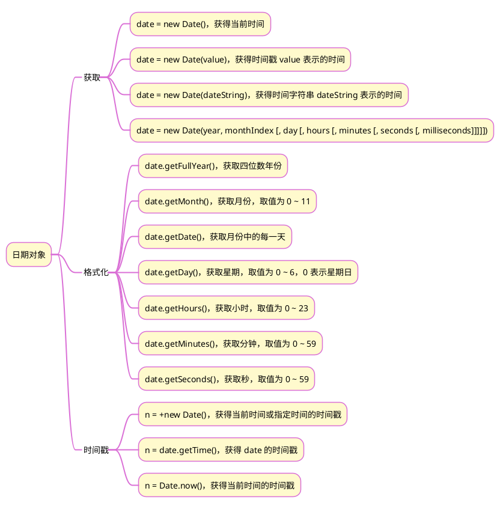

>《JavaScript 入门到精通》读书笔记之九

## 1 思维导图


## 2 下班倒计时案例

### 2.1 实现的功能：
1. 显示当前日期
2. 显示下班时间
3. 当天未到下班时间时，显示倒计时，达到或超过下班时间时，倒计时牌显示 0

### 2.2 解决思路
1. 设置下班时间的时、分、秒，并显示
2. 获取当前时间以及当前时间的时间戳
3. 显示当前日期 
4. 获取当前日期下班时间的时间戳
5. 获取两个时间戳的差值，如果值大于0，据此折算成时、分、秒，并显示
6. 设置 setInterval() 函数，每隔一秒执行上述2～5步骤

### 2.3 代码

```html
<!DOCTYPE html>
<html lang="en">

<head>
    <meta charset="UTF-8">
    <meta http-equiv="X-UA-Compatible" content="IE=edge">
    <meta name="viewport" content="width=device-width, initial-scale=1.0">
    <title>Document</title>
    <style>
        .box {
            width: 250px;
            height: 250px;
            background-color: rgb(233, 176, 204);
            color: white;
            text-align: center;
            padding: 10px;
        }

        .time {
            width: 35px;
            height: 35px;
            background-color: black;
            font-weight: bolder;
            line-height: 35px;
            font-size: 25px;

        }

        .timeBox {
            margin: auto;
            height: 50px;
            width: 130px;
            display: flex;
            justify-content: space-between;
        }
    </style>
</head>

<body>
    <div class="box">
        <h4 class="currentDate"></h4>
        <h1>下班倒计时</h1>
        <div class="timeBox">
            <div class="time" id="hours">0-</div>
            <div>:</div>
            <div class="time" id="minutes">0-</div>
            <div>:</div>
            <div class="time" id="seconds">0-</div>
        </div>
        <h3></h3>
    </div>
    <script>
        /* 下班时间 */
        const target = {};
        target.hours = '18';
        target.minutes = '30';
        target.seconds = '00';
        /* 显示下班时间 */
        const h3 = document.querySelector('h3');
        h3.innerHTML = `${target.hours}:${target.minutes}:${target.seconds}下课`;
        /* 获取倒计时显示牌DOM元素 */
        const hours = document.querySelector('#hours');
        const minutes = document.querySelector('#minutes');
        const seconds = document.querySelector('#seconds');

        function countDown() {
            /* 当前时间 */
            const current = {};
            current.date = new Date();
            current.year = current.date.getFullYear();
            current.month = current.date.getMonth() + 1;
            current.day = current.date.getDate();
            current.stamp = current.date.getTime();
            /* 显示当前时间 */
            const currentDate = document.querySelector('.currentDate');
            currentDate.innerHTML = `今天是${current.year}年${current.month}月${current.day}日`;

            /* 下班时间戳 */
            target.stamp = +new Date(current.year, current.month - 1, current.day, target.hours, target.minutes, target.seconds);

            /* 计算倒计时 */
            const countDownTime = {};
            /* 毫秒数转换为秒数 */
            countDownTime.stamp = (target.stamp - current.stamp) / 1000;
            if (countDownTime.stamp > 0) {
                /* 因为是同一天，countDownTime.hours 肯定小于 24，不需要模除24 */
                countDownTime.hours = Math.floor(countDownTime.stamp / 3600);
                countDownTime.minutes = Math.floor((countDownTime.stamp % 3600) / 60);
                countDownTime.seconds = Math.floor((countDownTime.stamp % 3600) % 60);
                /* 显示倒计时 */
                hours.innerHTML = ((countDownTime.hours).toString()).padStart(2, '0');
                minutes.innerHTML = ((countDownTime.minutes).toString()).padStart(2, '0');
                seconds.innerHTML = ((countDownTime.seconds).toString()).padStart(2, '0');
            };
        };        
        countDown();
        setInterval(countDown, 1000);
    </script>
</body>

</html>
```

{}显示时、分、秒时，一般均显示2位数，如果不足，首位要补0。方法有两种：
1. (hours.toString()).padStart(2, '0')
2. `hours = hours<10? '0'+hours :hours`

另外，因为时间戳的单位是毫秒，根据时间戳计算时、 分、秒时，要先将时间戳转换为秒。

 {}