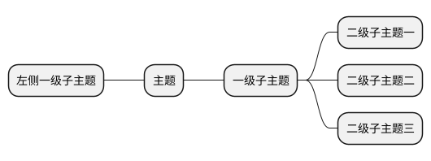
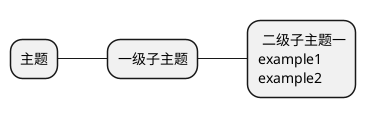
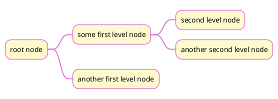
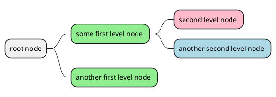
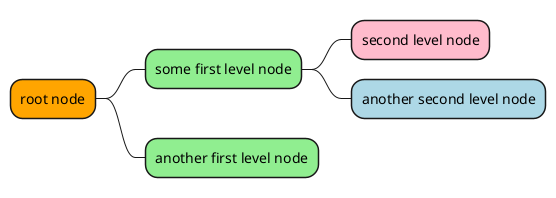
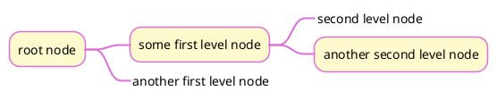
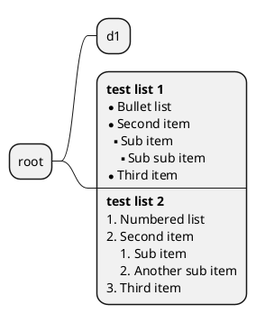

# 《plantUML 语言参考指引》读书笔记之二

## 1 开始和结束

`@startmindmap`开始

`@endmindmap`结束

## 2 子主题



## 3 内容多行表示

使用`:`开始多行内容，`;`结束多行内容。目前如果要使用`:` `;`只能用`*`Markdown语法新建分支



## 4 插入图片

```


```

## 5 设置颜色

### 5.1 全局设置

#### 5.1.1 skinparam 命令

相关的参数如下：

```
NodeBackgroundColor
NodeBorderColor
NodeFontColor
NodeFontName
NodeFontSize
NodeFontStyle
ArrowThickness
ArrowColor
```

用法：



#### 5.1.2 建立样式



### 5.2 单独设置



## 6 去除外边框

在节点前加上 _ 以去除外边框



## 7 添加图标

语法：<&ICON_NAME>


## 8 使用列表


