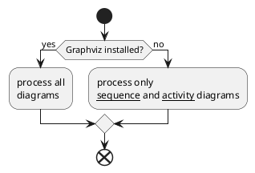
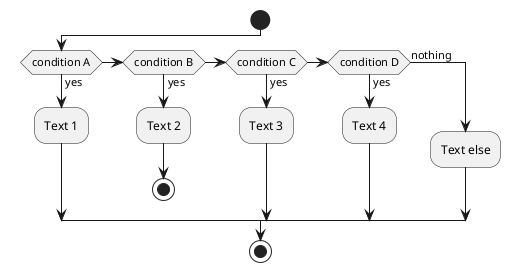
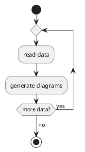
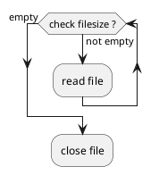
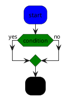
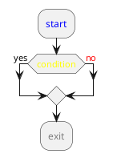
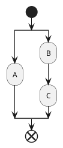
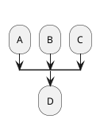
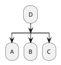
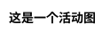

## 1 开始/结束

使用关键字 @startuml 和 @enduml 表示开始和结束。

使用关键字 start 和 end(stop) 表示子图的开始和结束。

## 2 顺序结构

以冒号开始，以分号结束。用法：

:文字内容;

## 3 条件语句

### 3.1 if-then-else-endif 结构



### 3.2 if-then-elif-else-endif 结构



## 4 循环结构

### 4.1 repeat-repeatwhile



### 4.2 while-endwhile



## 5 并行结构fork

```plantuml
fork
    :语句1;
fork again
    :语句2;
fork again
    :语句3;
end fork
```

## 6 注释

```plantuml
#语法一
floating note left:注释语句

#语法二
note right
    注释语句
end note
```

## 7 设置颜色

### 7.1 设置方法

- 使用标准名字，如：red，blue，white等。
- 使用十六进制写法，如：#AABBCC，#FF00FF等。

### 7.2 全局设置

#### 7.2.1 skinparam 命令

相关的参数如下：

```text
ActivityBackgroundColor
ActivityBarColor
ActivityBorderColor
ActivityBorderThickness
ActivityDiamondBackgroundColor
ActivityDiamondBorderColor
ActivityDiamondFontColor
ActivityDiamondFontName
ActivityDiamondFontSize
ActivityDiamondFontStyle
ActivityEndColor
ActivityFontColor
ActivityFontName
ActivityFontSize
ActivityFontStyle
ActivityStartColor
```

用法：

```plantuml
@startuml
	skinparam conditionStyle InsideDiamond
	skinparam ConditionEndStyle hline
	skinparam ArrowColor orchid
	skinparam ArrowThickness 2
	skinparam ActivityBackgroundColor lemonchiffon 
	skinparam ActivityBorderColor orchid
	skinparam ActivityBorderThickness 2
@enduml
```

### 7.3 单独设置

#### 7.3.1 设置背景颜色

在节点前面加上 #颜色名或十六进制代码: 。



#### 7.3.2 设置字体颜色

用<color:颜色名或十六进制代码>  </color>标签对 包裹文字。



## 8 分割与合并

### 8.1 分割

关键词：split, split again and end split



### 8.2 多端输入

使用 -[hidden]- > 隐藏箭头。去掉 start 和 end 关键词。



### 8.3 多端输出

关键词：kill or detach



## 9 标题

关键词：title



## 10 条件样式

```plantuml
skinparam conditionStyle InsideDiamond
skinparam ConditionEndStyle hline
```