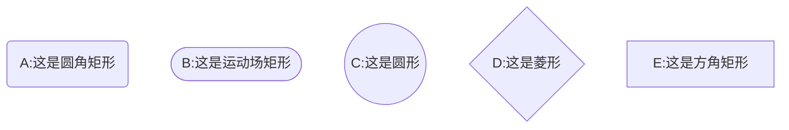
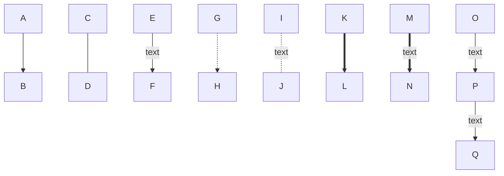
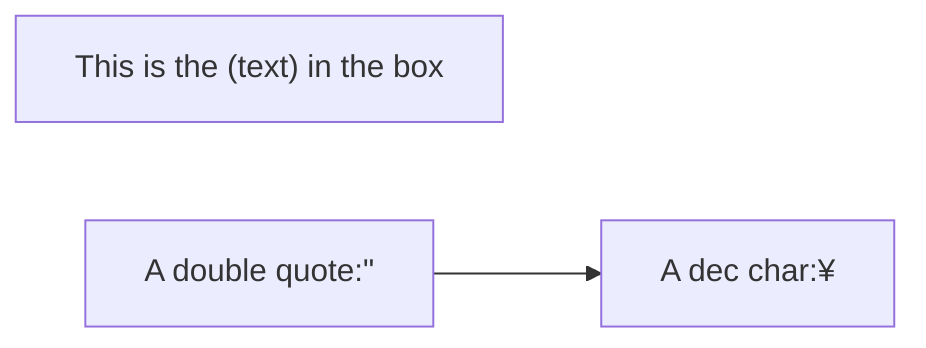
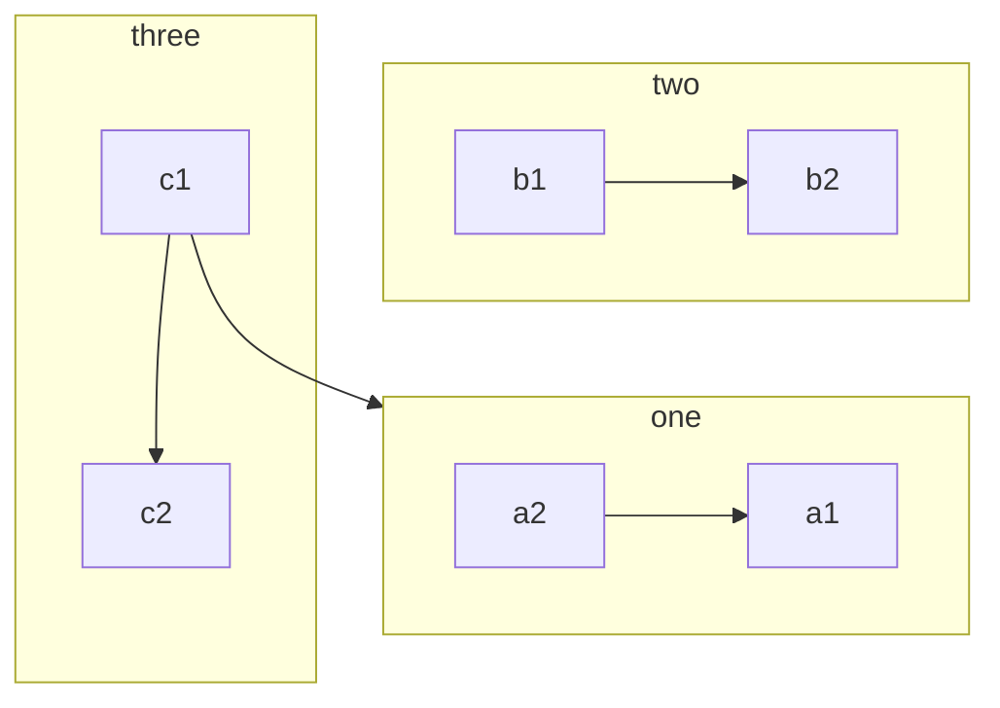
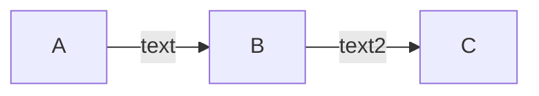
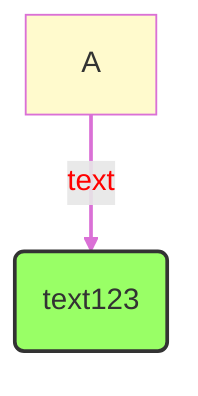
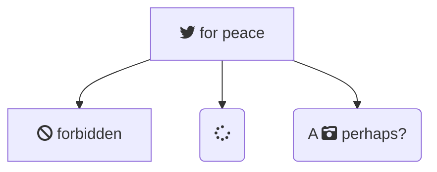

## 1 方向

- TB - top to bottom
- TD - top-down/ same as top to bottom
- BT - bottom to top
- RL - right to left
- LR - left to right

## 2 节点形状

## 3 连接线

连接线的长度和形状：

| Length | 1 | 2 | 3 |
| --- | --- | --- | --- |
| Normal | --- | ---- | ----- |
| Normal with arrow | --> | ---> | ----> |
| Thick | === | ==== | ===== |
| Thick with arrow | ==> | ===> | ====> |
| Dotted | -.- | -..- | -...- |
| Dotted with arrow | -.-> | -..-> | -...-> |

## 4 特殊符号

如果文本中有括号等特殊符号，文本应加上引号。特殊符号使用HTML名称

## 5 subgraph及其方向

语法格式：

subgraph title
    graph definition
end

方向用关键词 direction 设置。但有时因冲突而无效。

## 6 注释

由

## 7 样式

