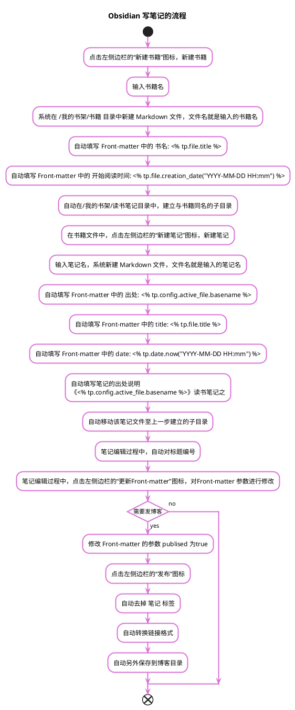

## 1 需要的插件
1. Templater
2. QuickAdd
4. Dataview
5. Commander
6. Yaml Manager
7. Number Headings
## 2 新建书籍
### 2.1 建立模板
#### 2.1.1 模板内容
1. Front-matter 部分
3. 笔记列表
4. 脚本命令
#### 2.1.2 Front-matter
可以自动完成填充的参数是：
>书名: `<% tp.file.title %>`
>开始阅读时间: `<% tp.file.creation_date("YYYY-MM-DD HH:mm") %>`

#### 2.1.3 笔记列表
以内部链接的形式建立笔记列表
#### 2.1.4 脚本命令
##### 2.1.4.1 建立 Python 脚本
文件名mkdir.py，内容为获取当前文件名，如果与该文件名同名的目录不存在，就创建。  
代码如下：
```python
import os
import sys  

# 获取文件名
filename = ' '.join(sys.argv[1:])
path = "F:\Obsidian\我的书架\读书笔记"
filepath = os.path.join(path,filename)

# 如果该文件名的目录不存在，就创建
if not os.path.exists(filepath):
    os.mkdir(filepath)
```

##### 2.1.4.2 配置 Templater插件
通用配置见[设置模板路径]()

新增自定义函数如下：


### 2.2 设置 QuickAdd 
建立“新建书籍”命令


>选择 Template，然后点击 Add Choice
>进行 Configure


>主要设置两项：
>>1. Template Path
>>2. Choose folder when creating a new note

>点亮闪电标志


### 2.3 为该命令设置 Commander
#### 2.3.1 在左侧边栏添加命令


#### 2.3.2 选择 QuickAdd 命令
选择[QuickAdd](#2.2-设置-QuickAdd)设置的 QuickAdd 命令


#### 2.3.3 选择图标和图标文字

### 2.4 利用模板新建书籍
点击左侧边栏的“新建书籍”图标。
## 3 新建笔记
### 3.1 建立笔记模板
>模板内容
1. Front-matter
2. 笔记出处的说明
3. 笔记内容
4. 脚本命令
### 3.2 Front-matter
可以自动完成填充的参数是：
source: `<% tp.config.active_file.basename %>`
title: `<% tp.file.title %>`
tags: `<% tp.user.active_file_tags() %>`
date: `<% tp.date.now("YYYY-MM-DD HH:mm") %>`
说明：
>`<% tp.config.active_file.basename %>`，表示当前文件的文件名，没有.md后缀。因此需要在书籍文件激活时，新建该书籍的笔记。
>`<% tp.user.active_file_tags() %>`，表示执行自定义函数 `active_file_tags`，返回所在激活文件的 tags 属性值。也就是说，该笔记继承了书籍的 tags 属性。
### 3.3 笔记出处的说明
`《<% tp.config.active_file.basename %>》读书笔记之`
只有在利用模板创建笔记的时候，才能自动填充。

### 3.4 笔记内容
文章标题自动编号，无需手动添加。每篇文章只设一个一级标题。
如果笔记内容较多，可以新增[笔记详情](#3.6-笔记详情)。

### 3.5 脚本命令
#### 3.5.1 获取激活文件的 tags 属性值

##### 3.5.1.1 配置 Templater 插件


##### 3.5.1.2 代码

```python 'active_file_tags.py'
import os
import sys
import re 

args = ' '.join(sys.argv[1:])  

# 获取仓库目录
root = re.search(r'[A-Z]\:.*?/', args)  

# 获取激活文件的相对仓库的文件路径名
active_file = re.search(r'.*?\.md', args)  

# 获取激活文件的绝对路径名
active_file_path=os.path.join(root.group(),active_file.group())  

with open(active_file_path,'r',encoding='utf-8') as f:
    content = f.read()
    
# 取得 tags 属性值
tags_value = re.search(r'(\ntags: )(.*?\n)', content)

print('[笔记,'+ tags_value.group(2)[1:-2]+']')
```

#### 3.5.2 移动笔记文件
该命令将笔记文件移动到与书籍名同名的目录中。
<% tp.file.move("我的书架/读书笔记/"+tp.config.active_file.basename+"/"+tp.file.title) %>

### 3.6 笔记详情
#### 3.6.1 建立笔记详情模板
参考建立书籍模板 和 设置 QuickAdd
区别是：
1. 不需要脚本
2. QuickAdd 设置中的文件存放目录设置为，笔记详情文件与笔记文件存放在同一目录。


## 4 发博客
笔记用 Obsidian 编写，博客采用 Hexo 框架，二者的衔接存在如下问题：
1. Obsidian 的格式与 Hexo 的有不一致，尤其是链接。
2. Obsidian 的仓库和 Hexo 的博客目录不是一个，写好的笔记需要复制到博客目录。
3. Obsidian 的笔记的有些内容在发博客时，需要调整。
>解决办法，参考[运行 python 脚本]()

### 4.1 编写Python 脚本
脚本名：article_to_blog.py
```python
#!/usr/bin/env python3
# -*- coding: utf-8 -*-
import sys
import os
import re
import time  

# 获取当前文件路径全名
path = ' '.join(sys.argv[1:])
with open(path,"r",encoding='utf-8') as f:
    content = f.read()
    
# 获取文件名
filename = re.search(r'[^\/]*\.md', path)  

# 去掉 Front Matter 中tags 的“笔记”值，
# 正则匹配时，因为有换行，而 . 不能匹配换行符，因此
# 采用 [\s\S]匹配所有字符
content = re.sub(r'(\-\-\-[\s\S]*tags?\:.*)(笔记\s*\,?)(.*)(\n)', r'\1\3\4',content)  

# 取消文章内部的书籍链接，亦即形如《》或《》的链接格式
content = re.sub(r'\《\[(.*)\]\((?!http:)(?!https:).*?\)\》',r"《\1》",content)
content = re.sub(r'\《\[\[(.*?)\]\]\》',r'《\1》',content)  

# 使用 img 标签代替 obsidian 图床链接格式
content = re.sub(r'\!\[image.*\|(\d*)\]\((https?\:\/\/.*?)\)',r'',content)  

# 调整站内文章跳转链接的格式，亦即形如[](非#开头，非http:开头，非https:开头，以.md结尾)的链接格式，从Obsidian 格式调整为 hexo 格式

titles = re.findall(r'\[.*?\](?!#)(?!http:)(?!https:).*?\.md\)', content)
for i in range(len(titles)):
    s = titles[i]
    
    # 将空格替换为 ' '
    s = re.sub(r'%20',r' ',s)

    # 转换链接格式
    s = re.sub(r'\[(.*?)\]\((.*?)\.md\)',r'',s)
    content = content.replace(titles[i],s)  

#调整当前文章内部锚点跳转链接的格式 ，形如[](#开头) ，调整为 hexo 格式
titles = re.findall(r'\[.*?\]\(#.*?\)',content)
results = []
for i in range(len(titles)):
    s = titles[i]

    # 将空格符号 %20 替换为 '-'
    s = re.sub(r'%20', r'-', s)

    # 将半角符号替换为 '-'，连续的半角符号只替换为一个 '-'
    s = re.sub(r'[\.\`\__\-\']+',r'-', s)
    content = content.replace(titles[i],s)    

# 调整站内其他文章锚点链接的格式，调整为 hexo 格式
titles = re.findall(r'\[.*?\]\(.*\.md#.*?\)',content)
for i in range(len(titles)):
    s = titles[i]
    
    # 提取文章名
    name = re.findall(r'\((.*?).md',s)    

    # 将空格符号 %20 替换为 ' '
    titlename = re.sub(r'%20', r' ', name[0])

    # 提取章节名称
    chapter = re.findall(r'#(.*)\)',s)    

    # 将空格符号 %20 替换为 '-'
    chaptername = re.sub(r'%20', r'-', chapter[0])

    # 将半角符号替换为 '-'，连续的半角符号只替换为一个 '-'
    chaptername = re.sub(r'[\.\`\__\-\']+',r'-', chaptername)

    # 建立 a 标签
    a_tag = '<a href="#' + chaptername + '">'+ re.sub(r'%20',r' ',chapter[0]) +'</a>'
    content = content.replace(titles[i],a_tag)   

posts_path = "F:\Blog\source\_posts"
with open(os.path.join(posts_path,filename.group()),'w',encoding='utf-8') as f:   

    # 将修改后的内容写入文件
    f.write(content)
```
### 4.2 在 Templater 插件里设置自定义函数
参考[用户的自定义函数]()
### 4.3 建立模板文件，调用上一步中设置的自定义函数
参考[3.3 用法]()
### 4.4 在 Templater 插件里，设置快捷键


### 4.5 在 Commander 插件里，设置命令图标
参考[为该命令设置 Commander](#2.3-为该命令设置-Commander)

## 5 总结
