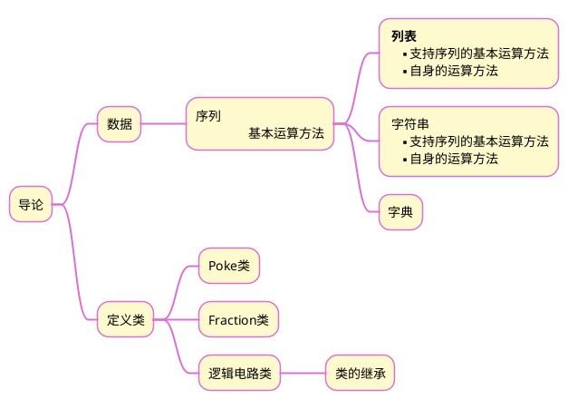

# 《Python 数据结构与算法分析(第2版)》读书笔记之一
## 1 思维导图

```plantuml
@startmindmap
skinparam ArrowColor orchid
skinparam ArrowThickness 2
skinparam NodeBackgroundColor lemonchiffon
skinparam NodeBorderColor orchid
skinparam NodeFontColor black
* 导论
** 数据
***:序列
		基本运算方法;
****: **列表**
***支持序列的基本运算方法
***自身的运算方法;
****: 字符串
***支持序列的基本运算方法
***自身的运算方法;
**** 字典
** 定义类
*** Poke类
*** Fraction类
*** 逻辑电路类
**** 类的继承
@endmindmap
```

## 2 笔记详情
1. [数据]()
2. [面向对象编程：定义类]()
