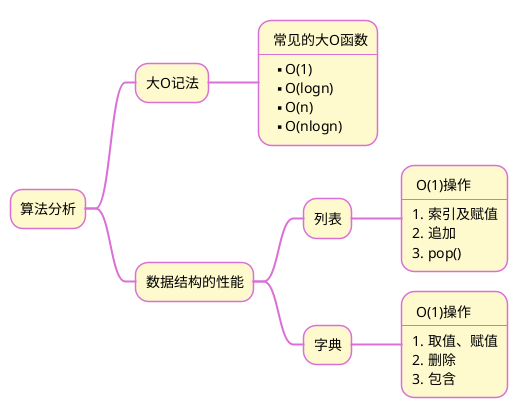

# 《Python 数据结构与算法分析(第2版)》读书笔记之二
## 1 思维导图

## 2 笔记要点
### 2.1 关键词
1. 大O记法
2. 时间复杂度
3. 线性
4. 对数
5. 线性对数
6. 指数

### 2.2 笔记摘录
1. 大O记法（O指order），记作O(f(n))。参数n常被称作问题规模，如列表中的长度。
2. 大O记法，一般表示的是平均情况，特殊情况下的时间复杂度可能会变大，即存在最坏情况。

### 2.3 总结
>[!summary]+ 总结
>算法分析关心的是解决问题所使用的计算资源，包括时间和空间。大O记法就是分析和比较算法执行所需要的时间。实际应用中，在空间资源保证的前提下，应采用大O效率高的算法。
 
## 3 笔记详情
1. [常见的大O函数]()
2. [timeit模块]()
3. [Python 数据结构的性能]()

