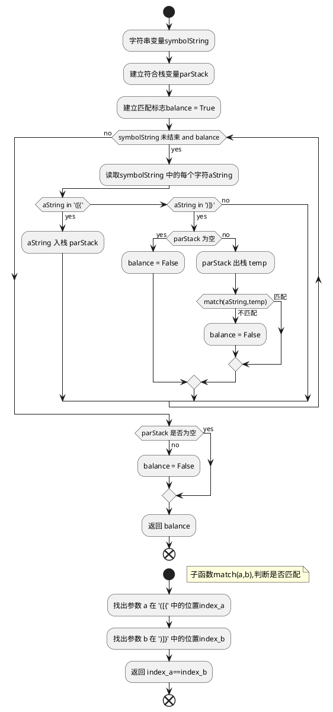
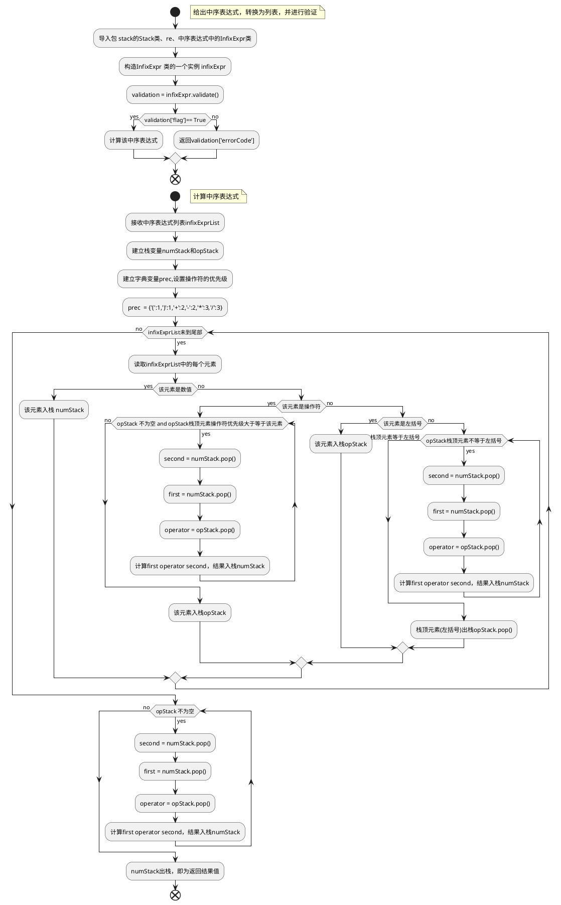

## 1 概述
栈的操作原则是LIFO(last-in first-out)，即后进先出。 当使用 Python 实现栈时，一般在列表的尾部入栈和出栈，操作是append(item)和pop()，其时间复杂度均为O(1)。如果在列表的头部入栈和出栈，操作是insert(0,item)和pop(0)，其时间复杂度均为O(n)，时间性能较差。
## 2 实现方法

```python
class Stack:
    def __init__(self):
        self.items = []

    def is_empty(self):
        return self.items == []

    def push(self,item):
        self.items.append(item)

    def pop(self):
        return self.items.pop()

    def peek(self):
        return self.items[-1]

    def size(self):
        return len(self.items)
```

## 3 实例：匹配括号
### 3.1 流程图



### 3.2 python 代码

```python
def parCheck_while(symbolString):
    def match(a,b):
        return ')]}'.index(a) == '([{'.index(b) 

    index  = 0
    parStack = Stack()
    balance = True
    while index < len(symbolString) and balance:
        if symbolString[index] in '([{':
            parStack.push(symbolString[index])
        elif symbolString[index] in ')]}':
            if parStack.is_empty():
                balance = False
            else:
                balance = match(symbolString[index],parStack.pop())
        index += 1
    if not parStack.is_empty():
        balance = False
    return balance

symbolString = '((()q)[()])'
print(parCheck_while(symbolString))
```

## 4 实例：直接的中序计算
### 4.1 流程图



### 4.2 Python 代码
```python
from stack import Stack
import re
class InfixExpr:
    def __init__(self,expr = None): 
        def exprToInfixList(expr):
            numList=[]
            exprList=[]
            for s in expr:
                if s.isnumeric() or s =='.':
                    numList.append(s)
                elif s in ['+','-','*','/','(',')']:
                    if len(numList)>0:
                        exprList.append(''.join(numList))
                        numList.clear()
                    exprList.append(s)
            if len(numList)>0:
                exprList.append(''.join(numList)) 
            return exprList
        self.expr= expr
        if not expr:
            self.expr = input('Enter a expr:-->')
        self.exprList = exprToInfixList(self.expr)
    def validate(self):        
        bracket = Stack()
        flag = True
        errorCode = ''
        result = {'flag':True,
                'errorCode':''}
        index = 0
        while (index < len(self.exprList) and flag == True):
            if index == 0 or index == len(self.exprList)-1:
                temp = self.exprList[index]
                if not (re.match('[0-9]+.?[0-9]*', temp)) or (self.exprList[abs(index-1)] not in ['+','-','*','/']):
                    flag = False 
                    errorCode = '首尾应为数值，并且第二和倒数第二元素为操作符'
            elif self.exprList[index] in ['+','-','*','/']:
                pre = self.exprList[index-1]
                next = self.exprList[index +1]
                if not re.match('[0-9]+.?[0-9]*', pre) and pre !=')':
                    flag = False
                    errorCode = '操作符前一个元素必须是数值或右括号'
                elif not re.match('[0-9]+.?[0-9]*', next) and next !='(':
                    flag = False
                    errorCode = '操作符后一个元素必须是数值或左括号'
            elif re.match('[0-9]+.?[0-9]*', self.exprList[index]):
                pre = self.exprList[index-1]
                next = self.exprList[index +1]
                if pre not in ['+','-','*','/'] and pre !='(':
                    flag = False
                    errorCode = '数值前一个元素必须是操作符或左括号'
                elif next not in ['+','-','*','/'] and next !=')':
                    flag = False
                    errorCode = '数值后一个元素必须是操作符或右括号'
            elif self.exprList[index]=='(':
                bracket.push('(')
            elif self.exprList[index]==')':
                if bracket.is_empty():
                    flag = False
                    errorCode = '括号不匹配'
                else:
                    bracket.pop()
            else:
                flag = False
                errorCode = '元素必须是操作符、左右括号和数值'
            index += 1
        if not bracket.is_empty() and flag==True:
            flag = False
            errorCode = '括号不匹配'
        result = {'flag':flag,
                'errorCode':errorCode}
        return result
        
def doMath(first,second,operator):
    if operator == '+':
        return first+second
    elif operator == '-':
        return first-second
    elif operator == '*':
        return first*second
    else:
        return first/second  

def infixExprEval(infixExprList):
    numStack = Stack()
    opStack = Stack()
    prec = {'(':1,
            ')':1,
            '+':2,
            '-':2,
            '*':3,
            '/':3}
    for expr in infixExprList:
        if re.match('^[0-9]+.?[0-9]*$', expr):
            numStack.push(expr)
        elif expr in ['+','-','*','/']:
            while not opStack.is_empty() and prec[opStack.peek()]>=prec[expr]:
                second = float(numStack.pop())
                first = float(numStack.pop())
                operator = opStack.pop()
                numStack.push(doMath(first,second,operator))
            opStack.push(expr)
        elif expr == '(':
            opStack.push(expr)
        else:
            while opStack.peek() != '(': 
                second = float(numStack.pop())
                first = float(numStack.pop())
                operator = opStack.pop()
                numStack.push(doMath(first,second,operator))
            opStack.pop()
    while not opStack.is_empty():
        second = float(numStack.pop())
        first = float(numStack.pop())
        operator = opStack.pop()
        numStack.push(doMath(first,second,operator))  
    return numStack.pop() 
```

```
