## 1 ���路



## 2 完整代�

```python
class Node:
    def __init__(self,item):
        self._value = item
        self._next = None

		def getValue(self):
        return self._value

    def getNext(self):
        return self._next

    def setValue(self,item):
        self._value = item

    def setNext(self,node):
        self._next = node

class UnorderedList:
    def __init__(self):
        self.head = None
        self.length = 0        

    def isEmpty(self):
        return self.head == None

    def add(self,item):
        node = Node(item)        
        current = self.head        
        self.head = node
        node.setNext(current)
        self.length += 1

    def search(self,item):
        current = self.head
        founded = False
        while current and not founded:
            if current.getValue() == item:
                founded = True
            else:
                current = current.getNext()
        return founded

    def remove(self,item):        
        current = self.head
        pre = None
        while current and current.getValue() != item:
            pre = current
            current = current.getNext()
        if not current:
            return False
        elif not pre:
            self.head = current.getNext()
        else:            
						pre.setNext(current.getNext())      
        self.length -= 1
            
    def append(self,item):
        node = Node(item)
        current = self.head
        if not current:
            self.head = node
        else:
            while current.getNext():
                current = current.getNext()
        current.setNext(node)
        self.length += 1    

    def insert(self,index,item):
        node = Node(item)
        current = self.head
        pos = 0       
        if self.isEmpty():
            self.head = node
        elif index == 0:
            self.head = node
            node._next = current
        else:
            pre = None        
            while pos < index and current:
                pos += 1
                pre = current
                current = current._next            
            pre._next = node
            node._next = current
        self.length += 1            

    def index(self,item):
        current = self.head
        pos = 0
        while current and current._value != item:
            pos += 1
            current = current._next
        if not current:
            return False
        else:
            return pos

    def pop(self,index=0):
        current = self.head
        pos = 0
        if not current:
            return False
        else:
            pre = None
            while current._next and pos<index:
                pos += 1
                pre = current
                current = current._next
            if pos == index:
                if not pre:                                   
                    self.head = current._next                                   
                else:
                    pre._next = current._next
                return current._value
            else:
                return False

		def assign(self,index,item):
        current = self.head
        pos = 0
        while current and pos<index:
            pos += 1
            current = current._next
        if not current:
            return False
        else:            
            current._value = item
        
    def __str__(self):
        value_list = []
        current = self.head
        while current:
            value_list.append(current._value)
            current = current._next
        return '{}'.format(value_list)

class UnorderedList_pro(UnorderedList):
    def __init__(self):
        super().__init__()
        self.rear = None   #设置这个��，是为了定�尾部，�� append 的时间��度O(1)

    def add(self,item):
        node = Node(item)        
        current = self.head
        if self.isEmpty():    #这是新�的
            self.rear = node
        self.head = node
        node._next = current
        self.length += 1

    def remove(self,item):        
        current = self.head
        pre = None
        while current and current._value != item:
            pre = current
            current = current._next
        if not current:
            return False
        elif not pre:
            self.head = current._next
        else:
            pre._next = current._next
        if not current._next:
            self.rear = pre   #这是新�的
        self.length -= 1

    def append(self,item):
        node = Node(item)
        if self.rear:
            self.rear._next = node
            self.rear = node
        else:
            self.head = node
            self.rear = node

    def insert(self,index,item):
        node = Node(item)
        current = self.head
        pos = 0
        if index >= self.length:
            self.rear = node     #这是新�的
        if self.isEmpty():
            self.head = node
        elif index == 0:
            self.head = node
            node._next = current
        else:
            pre = None        
            while pos < index and current:
                pos += 1
                pre = current
                current = current._next            
            pre._next = node
            node._next = current
        self.length += 1

    def pop(self,index=0):
        current = self.head
        pos = 0
        if not current:
            return False
        else:
            pre = None
            while current._next and pos<index:
                pos += 1
                pre = current
                current = current._next
            if pos == index:
                if not pre:                                   
                    self.head = current._next
                else:
                    pre._next = current._next                                 
                if not current._next:
                    self.rear = pre                                   
                return current._value
            else:
                return False

class OrderedList(UnorderedList_pro):
    def __init__(self):
        super().__init__()

    def add(self,item):
        node = Node(item)        
        current = self.head
        if self.isEmpty():
            self.rear = node
            self.head = node
        else:
            current = self.head
            pre = None
            while current._value < item and current._next:
                pre = current
                current = current._next
            if not pre:
                self.head = node
                node._next = current
            elif not current._next:
                current._next = node
            else:                
                pre._next = node
                node._next = current        
        self.length += 1       

```

## 3 链表�作的时间��度

| �作 | 时间��度 | 注释 |
| --- | --- | --- |
| isEmpty() | O(1) | �需执行一步�作，�检查 head 引用是�为 None |
| length | O(1) | 这是一个�性��，当出�链表长度�生�化的�作时，length �� |
| 无�链表的add() | O(1) | 新节点总在链表的第一个�置 |
| 有�链表的add() | O(n) | 需���链表，找到�适的�置 |
| seach() | O(n) |  |
| remove() | O(n) |  |
| 无�链表的append() | O(n)�O(1) | 当�加尾部指针��时，append() 的时间��度为O(1) |
| 无�链表的insert() | O(n) |  |
| index() | O(n) |  |
| pop(index) | O(n) |  |
| pop() | O(1) | 此时，�对链表头�作，�需��� |
| 无�链表的赋值 assign(index,item) | O(n) | 需���链表，找到�置 index |

>注�：
>在分�链表�作的时间��度时，�考虑其是�需���。
�†ã€‚
