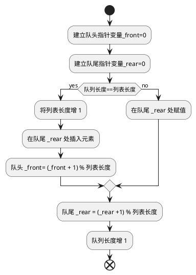
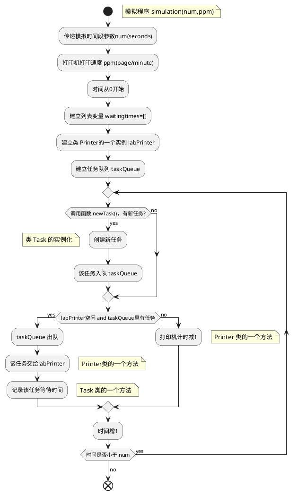

## 1 概述
队列的操作原则是 FIFO(first-in first-out)，即先进先出。最新添加的元素必须在队列的尾部等待，在队列中时间最长的元素则排在最前面。当使用 Python 列表实现队列时，需要确定列表的哪一端是队列的尾部，哪一端是头部。

## 2 实现方法一，列表头入队，列表尾出队

```python
class MyQueue:     #Queue 是 Python 中保留关键字
    def __init__(self):
        self._items=[]
        self.size = len(self._items)
    
    def isEmpty(self):
        return self._items == []

    def enqueue(self,item):
        self._items.insert(0, item)

    def dequeue(self):
        return self._items.pop()    
    
    def __str__(self):
        return '{}'.format(self._items)
```

>由上述代码可知，入队操作(添加元素，insert(0, item))的时间复杂度是O(n)，出队操作(移除元素，pop())的时间复杂度是O(1)。

## 3 实现方法二，列表尾入队，列表头出队

```python
class MyQueue:
    def __init__(self):
        self._items=[]
        self.size = len(self._items)      

    def isEmpty(self):
        return self._items == []

    def enqueue(self,item):        
        self._items.append(item)

    def dequeue(self):
        return self._items.pop(0)
    
    def __str__(self):
        return '{}'.format(self._items)
```

>由上述代码可知，入队操作(添加元素，append(item))的时间复杂度是O(1)，出队操作(移除元素，pop(0))的时间复杂度是O(n)。

## 4 实现方法三，用循环列表实现队列

该方法的思路，设置队头指针 front 和队尾指针 rear，入队操作时，在 rear 处赋值，然后 rear 增 1，出队操作时，取值 front ，然后 front 增 1。有两个问题需要解决：
1. 当 rear 或 front 增加值超过列表长度时的处理；
2. 当队列长度超过列表长度时的处理。
### 4.1 流程图如下：



### 4.2 实现代码如下：

```python
class MyQueue:
    def __init__(self,maxSize):
        self._maxSize = maxSize
        self._items=[None]*maxSize  #注意，要设置初始长度
        self._front = 0
        self._rear = 0
        self.size = 0

    def isEmpty(self):
        return self.size == 0

    def enqueue(self,item):
        if self.size == self._maxSize:
            self._maxSize += 1						
            self._items.insert(self._rear,item) 
            self._rear = (self._rear +1) % self._maxSize
            self._front = (self._front +1) % self._maxSize       
        else:
            self._items[self._rear] = item
						self._rear = (self._rear +1) % self._maxSize 
        self.size += 1                  

    def dequeue(self):
        if self.isEmpty():
            return 'wrong'
        else:
            result = self._items[self._front]
            self.size -= 1         
		        self._front = (self._front +1) % self._maxSize
		        return result
    
    def __str__(self):
        return str(self.size)
    
    def front(self):
        return self._items[self._front]

    def rear(self):
        return self._items[self._rear]

    def __str__(self):
        return '{}'.format(self._items)
```

>由上述代码可知，一般情况下(队列的长度小于 maxSize)，入队操作(添加元素，列表赋值)和出队操作(移除元素，列表赋值)的时间复杂度均是O(1)。

## 5 实现方法四，用单向列表实现队列，

列表尾入队，设置队头索引指针，该索引取值出队。初始指针为 0，每次出队后增 1。可以设置一个限值，当该指针超过限值时，删除指针前面的数据，收回空间。

```python
class MyQueue:
    def __init__(self,maxSize):
        self._maxSize = maxSize
        self._items = []
        self._front = 0
        self.size = 0

    def isEmpty(self):
        return self.size == 0
    
    def enqueue(self,item):
        self._items.append(item)
        self.size += 1     

    def dequeue(self):
        if self.isEmpty():
            return 'wrong'
        else:
            value = self._items[self._front]
            self._front += 1
            self.size -= 1
            if self._front == self._maxSize:
                self._items = self._items[self._front:]  #删除指针前面的数据
                self._front = 0
		        return value

    def front(self):
        return self._items[self._front]

    def rear(self):
        return self._items[-1]

    def __str__(self):
        return '{}'.format(self._items)
```

>由上述代码可知，一般情况下(列表的长度小于 maxSize)，入队操作(添加元素，append(item))和出队操作(移除元素，列表赋值)的时间复杂度均是O(1)。

## 6 模拟打印任务



由上述流程图可知，需要构造两个类，Task 和 Printer。
1. 类 Task 的属性包括创建时间(self.timestamp)和页数(self.pages)，方法是计算等待时间(Waittime(self,currenttime))。self.timestamp 由创建实例时提供，self.pages 为简化起见，随机取值。等待时间是 currenttime - self.timestamp。
2. 类 Printer 的属性包括打印速度(self.rate)、当前打印任务(self.currentTask)、打印剩余时间(self.timeremaining)。self.rate 由创建实例时提供。方法包括设置任务(setTask(self,newtask))、打印计时减 1 (tick(self))。

```python
from myqueue import MyQueue4
import random

class Task:
    def __init__(self,time):
        self.timestamp = time
        self.pages = random.randrange(1,21)

    def waittime(self,currenttime):
        return currenttime - self.timestamp

class Printer:
    def __init__(self,ppm):
        self.rate = ppm
        self.timeremaining = 0
        self.currentTask = None

    def is_Free(self):
        return self.currentTask == None

    def setTask(self,newtask):
        self.currentTask = newtask
        self.timeremaining = newtask.pages / self.rate * 60

    def tick(self):
        if self.timeremaining >=1:
            self.timeremaining -= 1
            if self.timeremaining == 0:
                self.currentTask = None

#假设平均3分钟产生一个新任务
def newTask():
    if random.randrange(1,181) == 180:
        return True
    else:
        return False

#需要传递模拟时间段num(seconds)和打印速度ppm(page/minute)
def simulation(num,ppm):
    taskQueue = MyQueue4(50)
    labPrinter = Printer(ppm)
    waitingtimes = []
    for currenttime in range(num): 
        if newTask():
            atask = Task(currenttime)            
            taskQueue.enqueue(atask)
        if labPrinter.is_Free() and not taskQueue.isEmpty():
            newtask = taskQueue.dequeue()
            labPrinter.setTask(newtask)
            waitingtimes.append(newtask.waittime(currenttime))
        else:
            labPrinter.tick()
    avg = sum(waitingtimes) /len(waitingtimes)
    print('Average wait {:.2f} secs {} tasks remain'.format(avg,taskQueue.size))

for i in range(10):
    simulation(7200,5)
```
