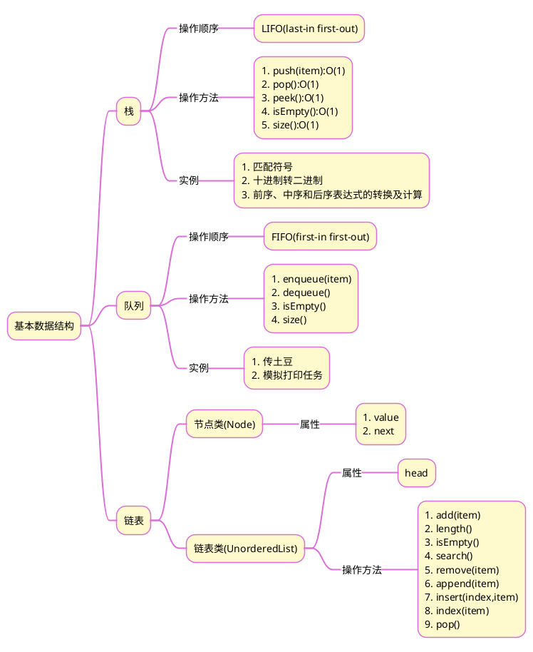

# 《Python 数据结构与算法分析(第2版)》读书笔记之三
## 1 思维导图

```plantuml
@startmindmap Mindmap
skinparam ArrowColor orchid
skinparam ArrowThickness 2
skinparam NodeBackgroundColor lemonchiffon
skinparam NodeBorderColor orchid
* 基本数据结构
** 栈
***_ 操作顺序
**** LIFO(last-in first-out)
***_ 操作方法
****:#push(item):O(1)
#pop():O(1)
#peek():O(1)
#isEmpty():O(1)
#size():O(1);
***_ 实例
****:#匹配符号
#十进制转二进制
#前序、中序和后序表达式的转换及计算;
** 队列
***_ 操作顺序
**** FIFO(first-in first-out)
***_ 操作方法
****:#enqueue(item)
#dequeue()
#isEmpty()
#size();
***_ 实例
****:#传土豆
#模拟打印任务;
** 链表
*** 节点类(Node)
****_ 属性
*****:#value
#next;
*** 链表类(UnorderedList)
****_ 属性
***** head
****_ 操作方法
*****:#add(item)
#length()
#isEmpty()
#search()
#remove(item)
#append(item)
#insert(index,item)
#index(item)
#pop();
@endmindmap
```

## 2 笔记要点 
>总结：
>当数据操作只涉及头尾时，考虑使用栈、队列、链表。因为这三种数据结构的取值和赋值操作，均需要遍历。

## 3 笔记详情
1. [栈]()
2. [队列]()
3. [双端队列]()
4. [链表]()
5. [编程练习]()