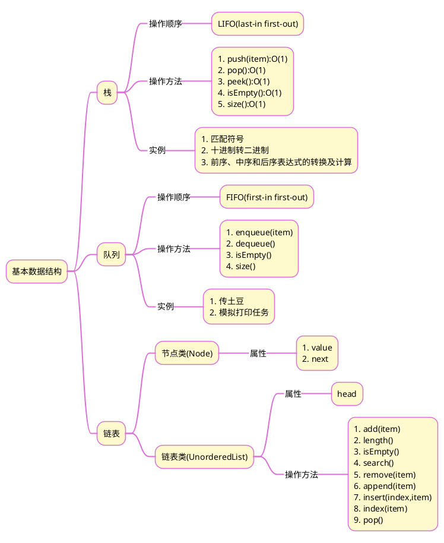

# 《Python 数据结构与算法分析(第2版)》读书笔记之三
## 1 思维导图

## 2 笔记要点 
>总结：
>当数据操作只涉及头尾时，考虑使用栈、队列、链表。因为这三种数据结构的取值和赋值操作，均需要遍历。

## 3 笔记详情
1. [[第3章 基本数据结构 栈|栈]]
2. [[第3章 基本数据结构 队列|队列]]
3. [[第3章 基本数据结构 双端队列|双端队列]]
4. [[第3章 基本数据结构 链表|链表]]
5. [[第3章 基本数据结构 编程练习|编程练习]]