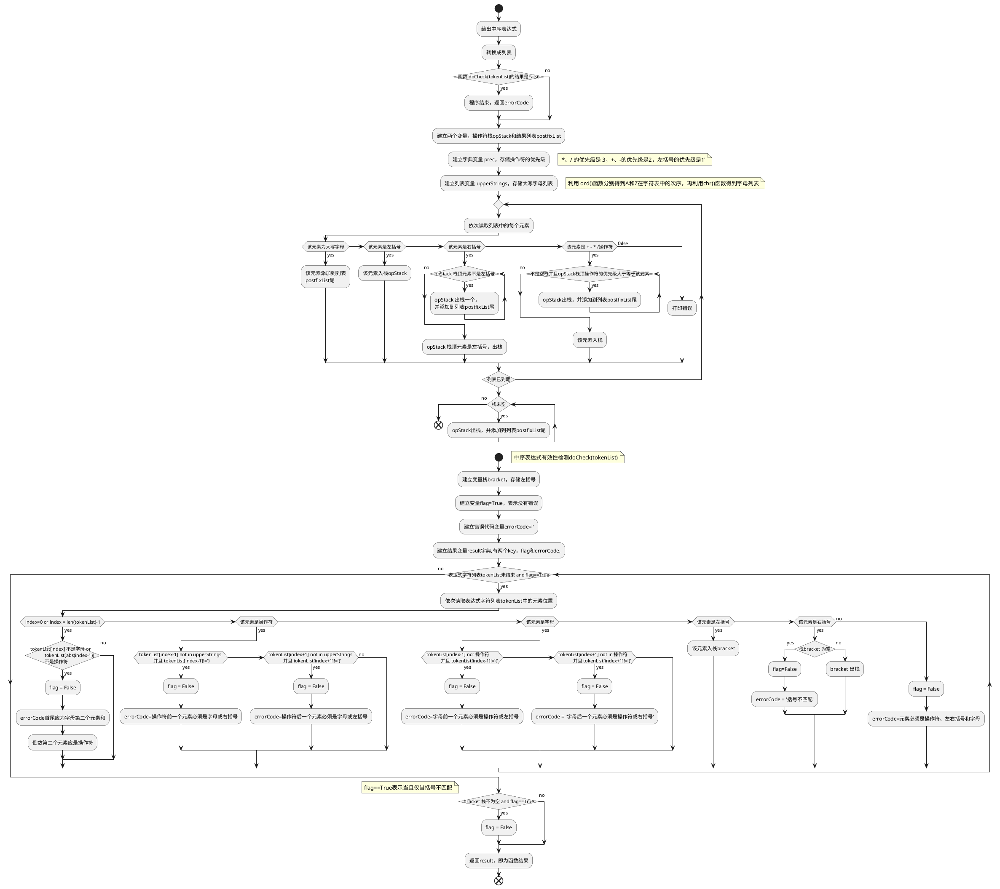
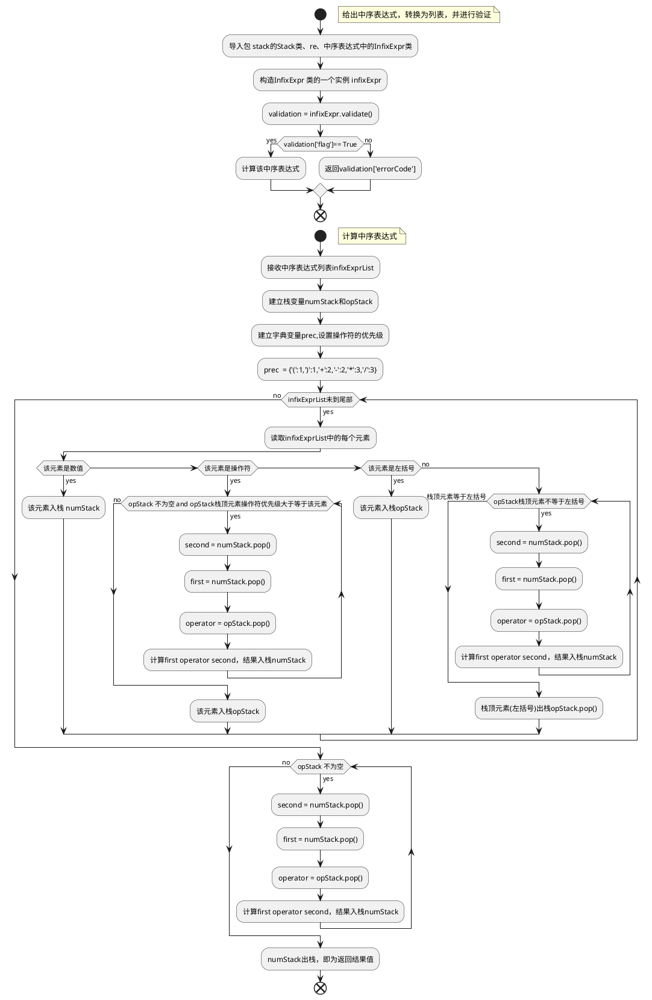
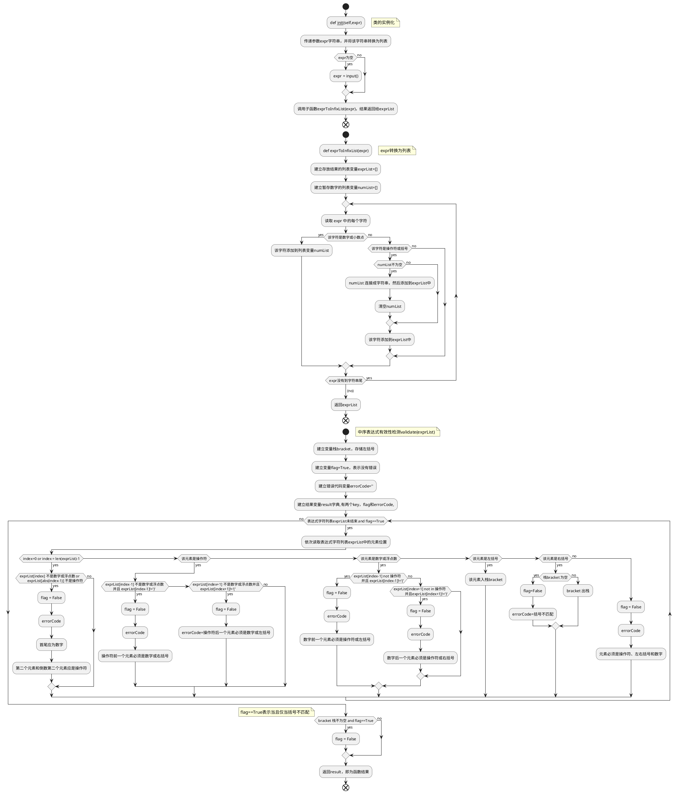

 # 《Python 数据结构与算法分析(第2版)》读书笔记之：编程练习1-3
## 1 编程练习1
### 1.1 要求
修改中序到后序的转换算法，能处理异常情况
### 1.2 流程图


完整代码
```python
from stack import Stack
    def infixTopostfix(infixexpr):    
        tokenList = [i for i in infixexpr if not i.isspace()]
        check = doCheck(tokenList)
        if check['flag'] == False:
            return check['errorCode']
        opStack = Stack()
        postfixList = []
        prec = {'*':3,
                '/':3,
                '+':2,
                '-':2,
                '(':1}
        upperStrings = [chr(i) for i in range(65,91)]
        for token in tokenList:
            if token in upperStrings:
                postfixList.append(token)
            elif token == '(':
                opStack.push(token)
            elif token == ')':
                while opStack.peek() != '(':
                    postfixList.append(opStack.pop())
                opStack.pop() 
            elif token in ['+','-','*','/']:
                while not opStack.is_empty() and prec[opStack.peek()]>=prec[token]:
                    postfixList.append(opStack.pop())
                opStack.push(token)
            else:
                print('wrong')
        while not opStack.is_empty():
            postfixList.append(opStack.pop())
        return ''.join(postfixList)
    
    def doCheck(tokenList):
        bracket = Stack()
        upperStrings = [chr(i) for i in range(65,91)]
        flag = True
        errorCode = ''
        result = {'flag':True,
                'errorCode':''}
        index = 0
        while (index < len(tokenList) and flag == True):
            if index == 0 or index == len(tokenList)-1:
                if (tokenList[index] not in upperStrings) or (tokenList[abs(index-1)] not in ['+','-','*','/']):
                    flag = False                
                    errorCode = '首尾应为字母，并且第二和倒数第二元素为操作符'
            elif tokenList[index] in ['+','-','*','/']:
                pre = tokenList[index-1]
                next = tokenList[index +1]
                if pre not in upperStrings and pre !=')':
                    flag = False
                    errorCode = '操作符前一个元素必须是字母'
                elif next not in upperStrings and next !='(':
                    flag = False
                    errorCode = '操作符后一个元素必须是字母'
    
            elif tokenList[index] in upperStrings:
                pre = tokenList[index-1]
                next = tokenList[index +1]
                if pre not in ['+','-','*','/'] and pre !='(':
                    flag = False
                    errorCode = '字母前一个元素必须是操作符或左括号'
                elif next not in ['+','-','*','/'] and next !=')':
                    flag = False
                    errorCode = '字母后一个元素必须是操作符或右括号'
            elif tokenList[index]=='(':
                bracket.push('(')
            elif tokenList[index]==')':
                if bracket.is_empty():
                    flag = False
                    errorCode = '括号不匹配1'
                else:
                    bracket.pop()
            else:
                flag = False
                errorCode = '元素必须是操作符、左右括号和字母'
            index += 1
        if not bracket.is_empty() and flag==True:
            flag = False
            errorCode = '括号不匹配2'
        result = {'flag':flag,
                'errorCode':errorCode}
        return result
```

## 2 编程练习2
### 2.1 要求
修改计算后序表达式的算法，使其能处理异常情况
### 2.2 代码
```python
from stack import Stack
def postfixEval(postfixExpr):
	tokenList = postfixExpr.split()
	numStack = Stack()
	for token in tokenList:
		if token.isnumeric():
			numStack.push(int(token))
		else:
			secondNum = int(numStack.pop())
			firstNum = int(numStack.pop())
			numStack.push(doMath(firstNum,secondNum,token))
	return numStack.pop()

def doMath(firstNum,secondNum,token):
	if token == '+':
		return firstNum + secondNum
	if token == '-':
		return firstNum - secondNum
	if token == '*':
		return firstNum * secondNum
	if token == '/':
		return firstNum / secondNum
```

## 3 编程练习3
### 3.1 要求
结合从中序到后序的转换算法以及计算后序表达式的算法，实现直接的中序计算。在计算时，应该使用两个栈从左往右处理中序表达式标记。一个栈用于保存运算符，另一个用于保存操作数。
### 3.2 流程图





### 3.3 代码
```python
from stack import Stack
class InfixExpr:
	def __init__(self,expr = None):        
		def exprToInfixList(expr):        
			numList=[]
			exprList=[]
			for s in expr:
				if s.isnumeric() or s =='.':
					numList.append(s)                
				elif s in ['+','-','*','/','(',')']:
					if len(numList)>0:
						exprList.append(''.join(numList))
						numList.clear()
					exprList.append(s)
			if len(numList)>0:
				exprList.append(''.join(numList))                
			return exprList
		
		self.expr= expr
		if not expr:
			self.expr = input('Enter a expr:-->')
		self.exprList = exprToInfixList(self.expr)
	
	def validate(self):
		import re
		bracket = Stack()        
		flag = True
		errorCode = ''
		result = {'flag':True,
				'errorCode':''}
		index = 0
		while (index < len(self.exprList) and flag == True):
			if index == 0 or index == len(self.exprList)-1:
				temp = self.exprList[index]
				if not (re.match('[0-9]+.?[0-9]*', temp)) or (self.exprList[abs(index-1)] not in ['+','-','*','/']):
					flag = False                
					errorCode = '首尾应为数值，并且第二和倒数第二元素为操作符'
			elif self.exprList[index] in ['+','-','*','/']:
				pre = self.exprList[index-1]
				next = self.exprList[index +1]
				if not re.match('[0-9]+.?[0-9]*', pre) and pre !=')':
					flag = False
					errorCode = '操作符前一个元素必须是数值或右括号'
				elif not re.match('[0-9]+.?[0-9]*', next) and next !='(':
					flag = False
					errorCode = '操作符后一个元素必须是数值或左括号'

			elif re.match('[0-9]+.?[0-9]*', self.exprList[index]):
				pre = self.exprList[index-1]
				next = self.exprList[index +1]
				if pre not in ['+','-','*','/'] and pre !='(':
					flag = False
					errorCode = '数值前一个元素必须是操作符或左括号'
				elif next not in ['+','-','*','/'] and next !=')':
					flag = False
					errorCode = '数值后一个元素必须是操作符或右括号'
			elif self.exprList[index]=='(':
				bracket.push('(')
			elif self.exprList[index]==')':
				if bracket.is_empty():
					flag = False
					errorCode = '括号不匹配'
				else:
					bracket.pop()
			else:
				flag = False
				errorCode = '元素必须是操作符、左右括号和数值'
			index += 1
		if not bracket.is_empty() and flag==True:
			flag = False
			errorCode = '括号不匹配'
		result = {'flag':flag,
				'errorCode':errorCode}
		return result
```

```python
from stack import Stack
import re
from 中序表达式 import InfixExpr

def doMath(first,second,operator):
	if operator == '+':
		return first+second
	elif operator == '-':
		return first-second
	elif operator == '*':
		return first*second
	else:
		return first/second

def infixExprEval(infixExprList):
	numStack = Stack()
	opStack = Stack()
	prec = {'(':1,
			')':1,
			'+':2,
			'-':2,
			'*':3,
			'/':3}
	for expr in infixExprList:
		if re.match('^[0-9]+.?[0-9]*$', expr):
			numStack.push(expr)
		elif expr in ['+','-','*','/']:                           
			while not opStack.is_empty() and prec[opStack.peek()]>=prec[expr]:              
				second = float(numStack.pop())
				first = float(numStack.pop())
				operator = opStack.pop()
				numStack.push(doMath(first,second,operator))
			opStack.push(expr)
		elif expr == '(':
			opStack.push(expr)
		else:
			while opStack.peek() != '(':                
				second = float(numStack.pop())
				first = float(numStack.pop())
				operator = opStack.pop()
				numStack.push(doMath(first,second,operator))
			opStack.pop()
	while not opStack.is_empty():
		second = float(numStack.pop())
		first = float(numStack.pop())
		operator = opStack.pop()
		numStack.push(doMath(first,second,operator))    
	return numStack.pop()

infixExpr = InfixExpr('3-(4+5)*2-3')
validation = infixExpr.validate()
if validation['flag'] == True:
	print(infixExprEval(infixExpr.exprList))
else:
	print(validation['errorCode'])
```

 


