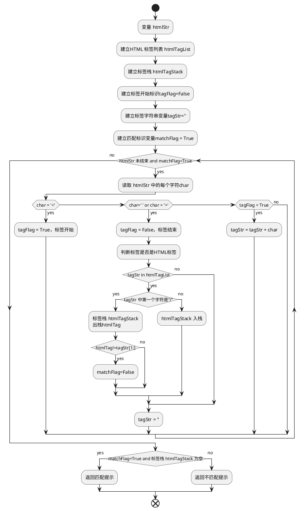

# 《Python 数据结构与算法分析(第2版)》读书笔记之：编程练习10-12

## 1 编程练习10
### 1.1 要求
实现基数排序
### 1.2 背景材料

十进制的基数排序是一个使用了“箱的集合”（包括一个主箱和 10 个数字箱）的机械分选技术。每个箱像队列（Queue）一样，根据数据项的到达顺序排好并保持它们的值。算法开始时，将每一个待排序数值放入主箱中。然后对每一个数值进行逐位的分析。每个从主箱最前端取出的数值，将根据其相应位上的数字放在对应的数字箱中。比如，考虑个位数字，534 被放置在数字箱 4，667 被放置在数字箱 7。一旦所有的数值都被放置在相应的数字箱中，所有数值都按照从箱 0 到箱 9 的顺序，依次被取出，重新排入主箱中。该过程继续考虑十位数字，百位数字，等等。当最后一位被处理完后，主箱中就包含了排好序的数值。

### 1.3 流程图

 ```plantuml
    @startuml 基数排序器
    start
    :构造主桶队列mainBucket，存放需排序的数字;
    :length = 队列mainBucket的长度;
    :建立结果列表resultList;
    :变量flag = False，标识排序是否结束;
    :建立数位分桶列表digitBucket，长度为 10，元素为队列digitQueue;
    :digit = 1，从个位开始;
    repeat    
        repeat
            :mainBucket出队一个 number;
            :调用 numberDigit(number,digit);
            if (函数结果为 -1) then(yes)
                :该结果添加到resultList尾部;            
            else(no)
                :该结果在digitBucket[函数结果]中入队;
            endif        
        repeat while (mainBucket未空) is (yes)
        -> no;
        if (resultList的长度=length) then (yes)
            :flag = True;
        else(no)
            :index = 0;
            while (index <=9) is(yes)
                while (digitBucket[index] 不未空) is(yes)
                    :digitBucket[index]出队;
                    :mainBucket入队;
                endwhile(no) 
                :index += 1;     
            endwhile (no) 
            :digit *= 10;
        endif     
    repeat while (flag) is(False)
    ->True;
    :返回结果resultList;  
    end
    @enduml
```

### 1.4 代码
```python
from myqueue import MyQueue1,MyQueue2,MyQueue3,MyQueue4
import numpy as np
import timeit

#获取十进制数 number 的 digit 分位数，如百分位(100)
def numberDigit(number,digit):
	numberStr = str(number)
	digitStr = str(digit)
	if len(numberStr) < len(digitStr):
		return -1
	return int(numberStr[-len(digitStr)])

def sorter_bak(numberlist):
	mainBucket = MyQueue3(6)
	for number in numberlist:
		mainBucket.enqueue(number)
	length = mainBucket.size
	resultList = []
	flag = False
	digitBucket = []       
	for i in range(10):
		digitQueue = MyQueue3(6)     
		digitBucket.append(digitQueue)
	digit = 1
	while not flag:
		while not mainBucket.isEmpty():
			number = mainBucket.dequeue()
			index = numberDigit(number,digit)
			if index==-1:                
				resultList.append(number)
			else:
				digitBucket[index].enqueue(number)
		if len(resultList) == length:
			flag = True
		else:
			index = 0
			while index<=9:
				while not digitBucket[index].isEmpty():
					mainBucket.enqueue(digitBucket[index].dequeue())
				index += 1
			digit *= 10
	return resultList

def sorter(numberlist,mainBucket,digitBucket): 
	for number in numberlist:
		mainBucket.enqueue(number)
	length = mainBucket.size
	resultList = []
	flag = False    
	digit = 1
	while not flag:
		while not mainBucket.isEmpty():
			number = mainBucket.dequeue()
			index = numberDigit(number,digit)
			if index==-1:                
				resultList.append(number)
			else:
				digitBucket[index].enqueue(number)
		if len(resultList) == length:
			flag = True
		else:
			index = 0
			while index<=9:
				while not digitBucket[index].isEmpty():
					mainBucket.enqueue(digitBucket[index].dequeue())
				index += 1
			digit *= 10
	return resultList

numberlist = np.random.randint(1,100000,1000)
result = {}
#构造MyQueue1的实例
mainBucket = MyQueue1()
digitBucket = []
for i in range(10):
	digitQueue = MyQueue1()
	digitBucket.append(digitQueue)
tt = timeit.Timer('sorter(numberlist,mainBucket,digitBucket)','from __main__ import sorter,numberlist,mainBucket,digitBucket')
result['MyQueue1'] = tt.timeit(1000)

#构造MyQueue2的实例
mainBucket = MyQueue2()
digitBucket = []
for i in range(10):
	digitQueue = MyQueue2()
	digitBucket.append(digitQueue)
tt = timeit.Timer('sorter(numberlist,mainBucket,digitBucket)','from __main__ import sorter,numberlist,mainBucket,digitBucket')
result['MyQueue2'] = tt.timeit(1000)

#构造MyQueue3的实例
mainBucket = MyQueue3(1000)
digitBucket = []
for i in range(10):
	digitQueue = MyQueue3(1000)
	digitBucket.append(digitQueue)
tt = timeit.Timer('sorter(numberlist,mainBucket,digitBucket)','from __main__ import sorter,numberlist,mainBucket,digitBucket')
result['MyQueue3'] = tt.timeit(1000)

#构造MyQueue4的实例
mainBucket = MyQueue4(1000)
digitBucket = []
for i in range(10):
	digitQueue = MyQueue4(1000)
	digitBucket.append(digitQueue)
tt = timeit.Timer('sorter(numberlist,mainBucket,digitBucket)','from __main__ import sorter,numberlist,mainBucket,digitBucket')
result['MyQueue4'] = tt.timeit(1000)

print(result)
```


## 2 编程练习11
### 2.1 要求
除了本章所举的例子，HTML中也存在括号匹配问题。标签有开始和结束两种形式，并且需要互相匹配才能正确描述网页内容。下面是简单的HTML标签，用于展示标签的匹配和嵌套。写一个程序来检查HTML文档中的标签是否正确匹配。

### 2.2 流程图



### 2.3 代码
```python
from stack import Stack

def matchTag(htmlStr):
	htmlTagList = ['html','/html','head','/head','body','/body','title','/title','div','/div','a','/a']
	htmlTagStack = Stack()
	tagFlag = False
	tagStr = ''
	matchFlag = True
	index = 0
	while index<len(htmlStr) and matchFlag:
		char = htmlStr[index]
		if char == '<':
			tagFlag = True
		elif char == ' ' or char == '>':
			tagFlag = False
			if tagStr in htmlTagList:
				if tagStr[0] == '/':
					htmlTag = htmlTagStack.pop()
					if htmlTag != tagStr[1:]:
						matchFlag = False
				else:
					htmlTagStack.push(tagStr) 
			tagStr = ''       
		elif tagFlag:
			tagStr = tagStr + char
		index += 1
	return matchFlag and htmlTagStack.is_empty()

htmlStr = """<html>
<head>
<title>我的第一个 HTML 页面</title>
</head>
<body>
<p>body 元素的内容会显示在浏览器中。</p>
<p>title 元素的内容会显示在浏览器的标题栏中。</p>
</body>
</html>"""
print(matchTag(htmlStr))
```


## 3 编程练习12
### 3.1 要求
扩展回文检测器，使其可以检测包含空格的回文。如果忽略其中的空格，那么 I PREFER PI 就是回文。
### 3.2 解决思路
添加空格判断语句，使得空格不进入双端队列
### 3.3 原来的回文检测器
见 <a href="#5-2-实例：回文检测">5.2 实例：回文检测</a>
### 3.4 扩展后的回文检测器
```python
def palChecker2(aString):
	stringDeque = Deque()
	for s in aString:
		if s != ' ':    #添加空格判断
			stringDeque.addRear(s)
	balanced = True    
	while stringDeque.size() > 1 and balanced:
		if stringDeque.removeFront() != stringDeque.removeRear():
			balanced = False
	return balanced
```


### 3.5 也可以直接利用字符串功能实现。
```python
def palChecker1(aString):
        balanced = True
        i = 0
        aString = aString.replace(' ','')   #添加空格去除语句
        while i < len(aString) // 2 and balanced:    
            if aString[i] != aString[(i+1)*(-1)]:
                balanced = False
            i += 1
        return balanced
```
