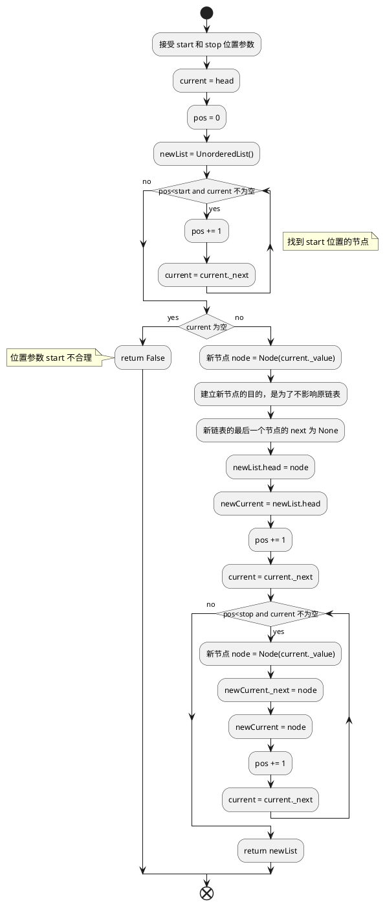

## 1 编程练习19
### 1.1 要求
实现UnorderedList 类的 slice 方法。该方法接受 start 和 stop 两个参数，并且返回一个从 start 位置开始，到 stop 位置结束的新链表(但不包含 stop 位置上的元素)。
当 stop 没有值或者小于等于 start 时，为 UnorderedList 类的取值功能。可以将 stop 的默认值设为 0。
### 1.2 思路
首先遍历链表，找到 start 位置，然后继续遍历，直到 stop 位置。因为不能改变原链表，新链表必须新建节点，节点内容等于原链表相应的节点，这样新链表的最后一个节点的 next 等于 None，不改变原链表的相应节点的 next 。
### 1.3 流程图


### 1.4 代码
```python
def slice(self,start,stop=0):
	current = self.head
	pos = 0
	newList = UnorderedList()
	while pos<start and current:
		pos += 1
		current = current._next
	if current:
		node = Node(current._value)
		newList.head = node
		newCurrent = newList.head
		pos += 1
		current = current._next
		while pos<stop and current:
			node = Node(current._value)
			newCurrent._next = node
			newCurrent = node
			pos += 1
			current = current._next
		return newList
	else:
		return False
```

## 2 编程练习20
实现有序列表抽象数据类型剩余的方法

略

## 3 编程练习21

思考有序列表和无序列表的关系。实现继承结构
见[实现思路]()
