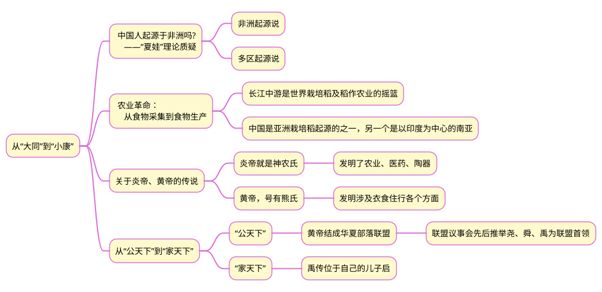

# 《国史十六讲(修订版)》读书笔记之一
## 1 思维导图

```plantuml
@startmindmap Mindmap
skinparam ArrowColor orchid
skinparam ArrowThickness 2
skinparam NodeBackgroundColor lemonchiffon
skinparam NodeBorderColor orchid
skinparam NodeFontColor black
* 从“大同”到“小康”
**: 中国人起源于非洲吗?
    ——“夏娃”理论质疑;
*** 非洲起源说
*** 多区起源说
**: 农业革命：
    从食物采集到食物生产;
*** 长江中游是世界栽培稻及稻作农业的摇篮
*** 中国是亚洲栽培稻起源的之一，另一个是以印度为中心的南亚
** 关于炎帝、黄帝的传说
*** 炎帝就是神农氏
**** 发明了农业、医药、陶器
*** 黄帝，号有熊氏
**** 发明涉及衣食住行各个方面
** 从“公天下”到“家天下”
*** “公天下”
**** 黄帝结成华夏部落联盟
***** 联盟议事会先后推举尧、舜、禹为联盟首领
*** “家天下”
**** 禹传位于自己的儿子启
@endmindmap
```

## 2 笔记要点

 

### 2.1 关键词

- 大同之世
- 小康之世

 

{}“大同之世”与“小康之世”的根本区别在于，前者是“天下为公”的社会，也就是“公天下”，后者是“天下为家”的社会，也就是“家天下”。

 {}
