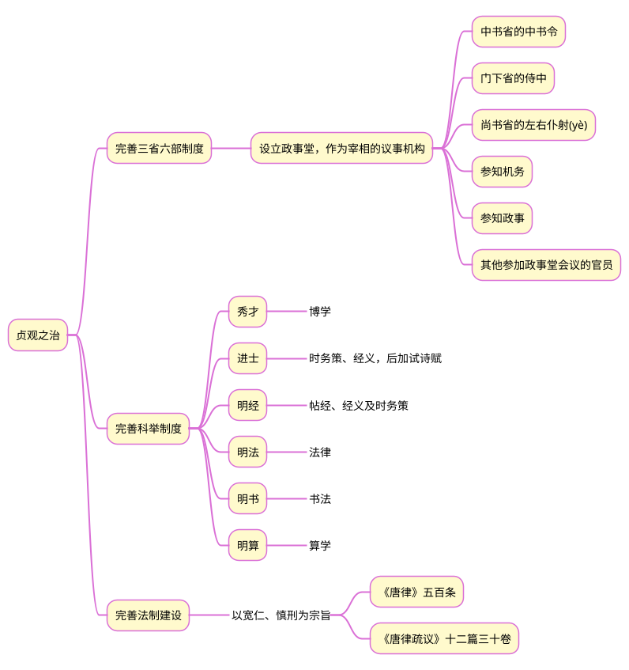
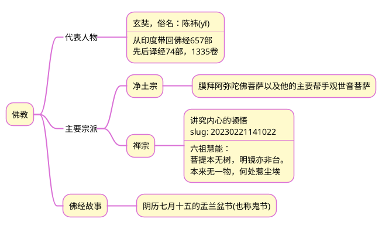

# 《国史十六讲(修订版)》读书笔记之七## 1 隋、唐的关系

## 2 贞观之治

## 3 盛唐文化

>1. 在继承传统文化的基础上，大量吸收外来文化，为唐文化提供了融合的广度与深度。
>2. 盛唐社会的自由开放、放任自流，艺坛的思想奔涌、百花齐放，培育了一大批艺术天才，这个时期的诗歌、音乐、舞蹈、书法、绘画都是空前绝后的，它们交相辉映，勾勒出美妙绝伦的盛唐气象。

## 4 佛教

佛教从汉朝时传入中国，经过南北朝时期的发展，到了唐朝进入了全盛时代，对于文化生活、经济生活、精神生活等方面产生了无孔不入的影响。

