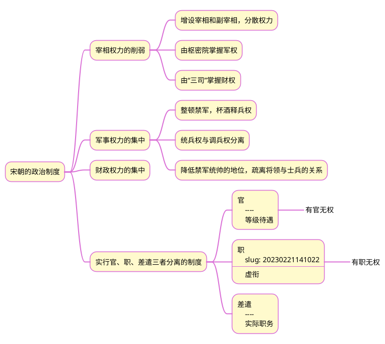
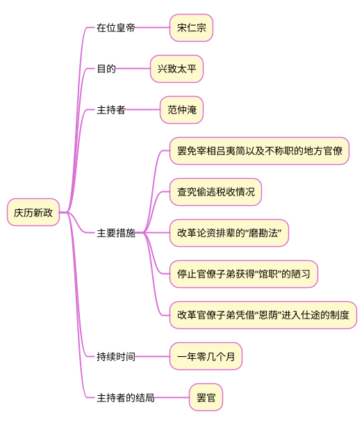
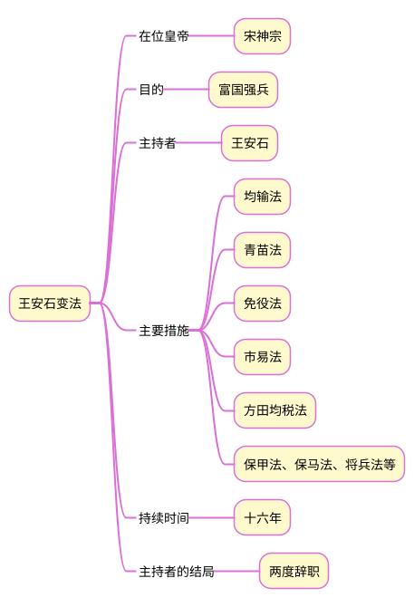

# 《国史十六讲(修订版)》读书笔记之九
## 1 宋朝的官僚政治

### 1.1 思维导图

```plantuml
@startmindmap Mindmap
    skinparam ArrowColor orchid
    skinparam ArrowThickness 2
    skinparam NodeBackgroundColor lemonchiffon
    skinparam NodeBorderColor orchid
    * 宋朝的政治制度
    ** 宰相权力的削弱
    *** 增设宰相和副宰相，分散权力
    *** 由枢密院掌握军权
    *** 由“三司”掌握财权
    ** 军事权力的集中
    *** 整顿禁军，杯酒释兵权
    *** 统兵权与调兵权分离
    *** 降低禁军统帅的地位，疏离将领与士兵的关系
    ** 财政权力的集中
    ** 实行官、职、差遣三者分离的制度
    ***:官
    ----
    等级待遇;
    ****_ 有官无权
    ***:职
    slug: 20230221141022
----
    虚衔;
    ****_ 有职无权
    ***:差遣
    ----
    实际职务;
    @endmindmap
```

## 2 两场改革

### 2.1 庆历新政
> 思维导图

```plantuml
@startmindmap Mindmap
    skinparam ArrowColor orchid
    skinparam ArrowThickness 2
    skinparam NodeBackgroundColor lemonchiffon
    skinparam NodeBorderColor orchid
    * 庆历新政
    **_ 在位皇帝
    *** 宋仁宗
    **_ 目的
    *** 兴致太平
    **_ 主持者
    *** 范仲淹
    **_ 主要措施
    *** 罢免宰相吕夷简以及不称职的地方官僚
    *** 查究偷逃税收情况
    *** 改革论资排辈的“磨勘法”
    *** 停止官僚子弟获得“馆职”的陋习
    *** 改革官僚子弟凭借“恩荫”进入仕途的制度
    **_ 持续时间
    *** 一年零几个月
    **_ 主持者的结局
    *** 罢官
    @endmindmap
```
### 2.2 王安石变法

>思维导图

```plantuml
@startmindmap Mindmap
    skinparam ArrowColor orchid
    skinparam ArrowThickness 2
    skinparam NodeBackgroundColor lemonchiffon
    skinparam NodeBorderColor orchid
    * 王安石变法
    **_ 在位皇帝
    *** 宋神宗
    **_ 目的
    *** 富国强兵
    **_ 主持者
    *** 王安石
    **_ 主要措施
    *** 均输法
    *** 青苗法
    *** 免役法
    *** 市易法
    *** 方田均税法
    *** 保甲法、保马法、将兵法等
    **_ 持续时间
    *** 十六年
    **_ 主持者的结局
    *** 两度辞职
    @endmindmap
```
