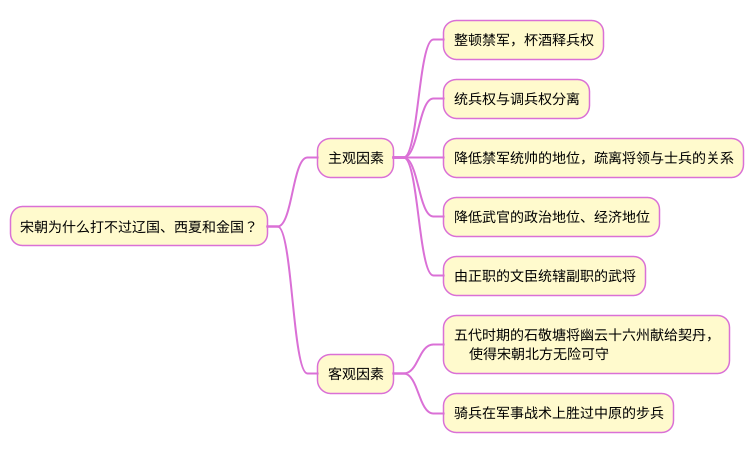

# 《国史十六讲(修订版)》读书笔记之十一

## 1 宋朝的经济、科技实力都很强，可为何总是打不过辽国、西夏和金国？

## 2 党项族、契丹族、女真族，现在的状况？

- 党项族在西夏被蒙古灭亡后、契丹族在西辽被蒙古灭亡后，逐渐融入了其他各民族。
- 女真族在金朝被蒙古灭亡后，其中的一部分衍化为满族。

## 3 忽必烈为什么要建立元朝？

### 3.1 忽必烈热心于汉化，遭到正统的蒙古人反对

忽必烈在藩王时代便热心于汉化，向汉人请教用儒学治国之道，成为大汗后，他提倡文治，改革蒙古旧制，实行汉化。而正统的蒙古人则坚持蒙古传统，不愿改变。忽必烈既然不想接照蒙古的传统来治理蒙古，蒙古帝国自然也不再属于他了。

### 3.2 汗位争夺，造成蒙古帝国的分裂

成吉思汗死后，指定窝阔台继位。窝阔台死后，其长子贵由在忽里台大会上继承了汗位。贵由死后，拖雷之子蒙哥即位，窝阔台家族认定拖雷后人占据大汗之位是非法的，故而萌生了反叛想法，分裂就此产生。蒙哥死后，拖雷另外两个儿子阿里不哥与忽必烈争夺汗位。虽然阿里不哥得到了大部分的蒙古王公的支持，但最终忽必烈胜出。忽必烈虽然登上汗位，但是蒙古的几大汗国纷纷自立，蒙古帝国土崩瓦解，忽必烈只能另起炉灶。