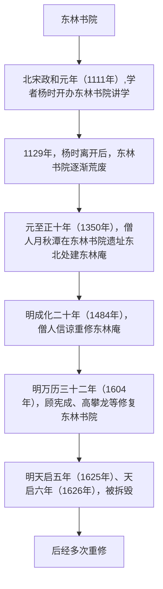

>《国史十六讲(修订版)》读书笔记之十三

## 1 王阳明的心学
### 1.1 产生的背景
从南宋晚期直至明朝中期，朱熹的理学始终稳居官方钦定的正统思想地位，科举取士都以朱熹的经注作为标准答案，朱子学唯我独尊。士子门不敢有所超越，缺乏自觉、自由的思想。
### 1.2 主要观点
1. 以吾心之是非为是非
2. 求诸心而得，虽其言之非出于孔子者，亦不敢以为非也；求诸心而不得，虽其言之出于孔子者，亦不敢以为是也
3. 夫道，天下之公道也；学，天下之公学也。非朱子可得而私也，非孔子可得而私也
4. 知行合一，事上练
5. 破山中贼易，破心中贼难
6. 此心光明，亦复何言
## 2 东林书院
### 2.1 历史沿革

### 2.2 主要成就
**风声雨声读书声声声入耳，家事国事天下事事事关心**

‌‌‌

‌‌‌　　