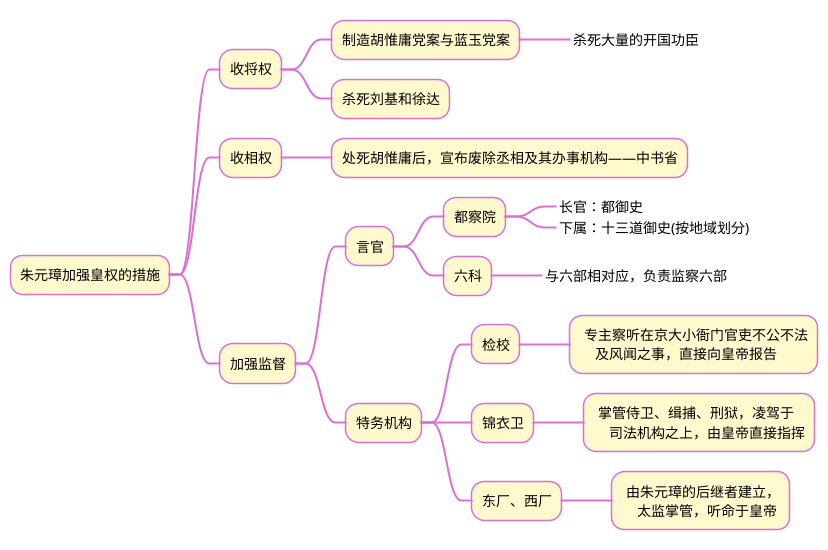

>《国史十六讲(修订版)》读书笔记之十二

```plantuml
@startmindmap Mindmap
    skinparam ArrowColor orchid
    skinparam ArrowThickness 2
    skinparam NodeBackgroundColor lemonchiffon
    skinparam NodeBorderColor orchid
    * 朱元璋加强皇权的措施
    ** 收将权
    *** 制造胡惟庸党案与蓝玉党案
    ****_ 杀死大量的开国功臣
    *** 杀死刘基和徐达
    ** 收相权
    *** 处死胡惟庸后，宣布废除丞相及其办事机构——中书省
    ** 加强监督
    *** 言官
    **** 都察院
    *****_ 长官：都御史
    *****_ 下属：十三道御史(按地域划分)
    **** 六科
    *****_ 与六部相对应，负责监察六部
    *** 特务机构
    **** 检校
    *****: 专主察听在京大小衙门官吏不公不法
    及风闻之事，直接向皇帝报告;
    **** 锦衣卫
    *****: 掌管侍卫、缉捕、刑狱，凌驾于
    司法机构之上，由皇帝直接指挥;
    **** 东厂、西厂
    *****: 由朱元璋的后继者建立，
    太监掌管，听命于皇帝;
    
@endmindmap
```
