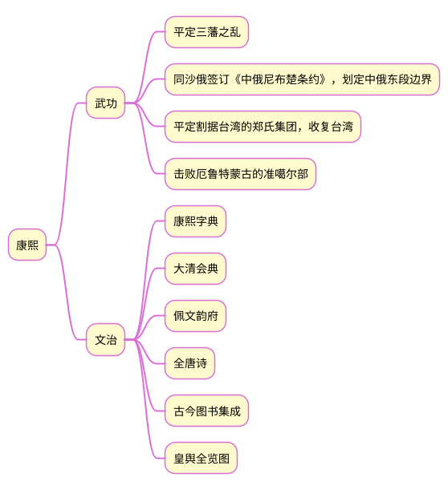
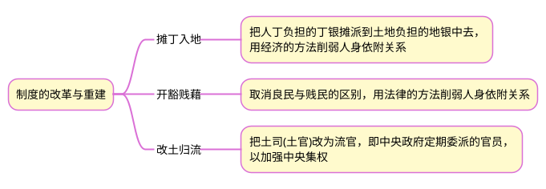
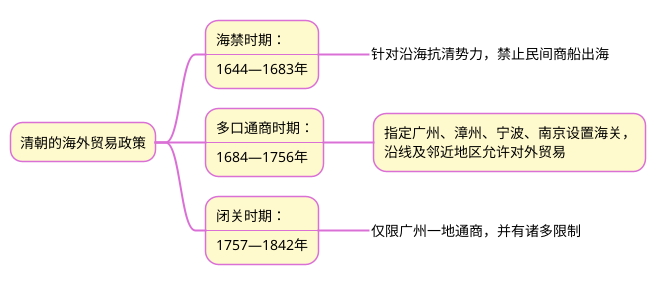
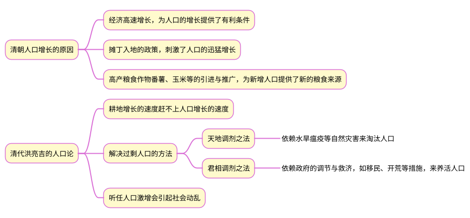

>《国史十六讲(修订版)》读书笔记之十六

## 1 康熙的文治与武功

```plantuml
@startmindmap
skinparam ArrowColor orchid
skinparam ArrowThickness 2
skinparam NodeBackgroundColor lemonchiffon
skinparam NodeBorderColor orchid
skinparam NodeFontColor black
* 康熙
** 武功
*** 平定三藩之乱
*** 同沙俄签订《中俄尼布楚条约》，划定中俄东段边界
*** 平定割据台湾的郑氏集团，收复台湾
*** 击败厄鲁特蒙古的准噶尔部
** 文治
*** 康熙字典
*** 大清会典
*** 佩文韵府
*** 全唐诗
*** 古今图书集成
*** 皇舆全览图
@endmindmap
```

## 2 雍正的政绩

```plantuml
@startmindmap
skinparam ArrowColor orchid
skinparam ArrowThickness 2
skinparam NodeBackgroundColor lemonchiffon
skinparam NodeBorderColor orchid
skinparam NodeFontColor black
* 制度的改革与重建
**_ 摊丁入地
***:把人丁负担的丁银摊派到土地负担的地银中去，
用经济的方法削弱人身依附关系;
**_ 开豁贱藉
*** 取消良民与贱民的区别，用法律的方法削弱人身依附关系
**_ 改土归流
***:把土司(土官)改为流官，即中央政府定期委派的官员，
以加强中央集权;
@endmindmap
```

## 3 闭关自锁的天朝

```plantuml
@startmindmap
skinparam ArrowColor orchid
skinparam ArrowThickness 2
skinparam NodeBackgroundColor lemonchiffon
skinparam NodeBorderColor orchid
skinparam NodeFontColor black
* 清朝的海外贸易政策
**:海禁时期：
----
1644—1683年;
***_ 针对沿海抗清势力，禁止民间商船出海
**:多口通商时期：
----
1684—1756年;
***:指定广州、漳州、宁波、南京设置海关，
沿线及邻近地区允许对外贸易;
**:闭关时期：
----
1757—1842年;
***_ 仅限广州一地通商，并有诸多限制
@endmindmap
```

## 4 人口压力与社会危机

```plantuml
@startmindmap
skinparam ArrowColor orchid
skinparam ArrowThickness 2
skinparam NodeBackgroundColor lemonchiffon
skinparam NodeBorderColor orchid
skinparam NodeFontColor black
* 清朝人口增长的原因
** 经济高速增长，为人口的增长提供了有利条件
** 摊丁入地的政策，刺激了人口的迅猛增长
** 高产粮食作物番薯、玉米等的引进与推广，为新增人口提供了新的粮食来源
* 清代洪亮吉的人口论
** 耕地增长的速度赶不上人口增长的速度
** 解决过剩人口的方法
*** 天地调剂之法
****_ 依赖水旱瘟疫等自然灾害来淘汰人口
*** 君相调剂之法
****_ 依赖政府的调节与救济，如移民、开荒等措施，来养活人口
** 听任人口激增会引起社会动乱
@endmindmap
```