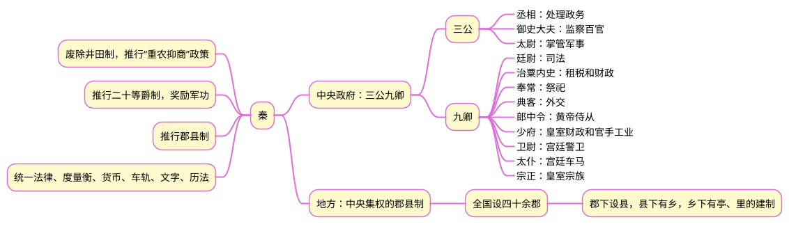
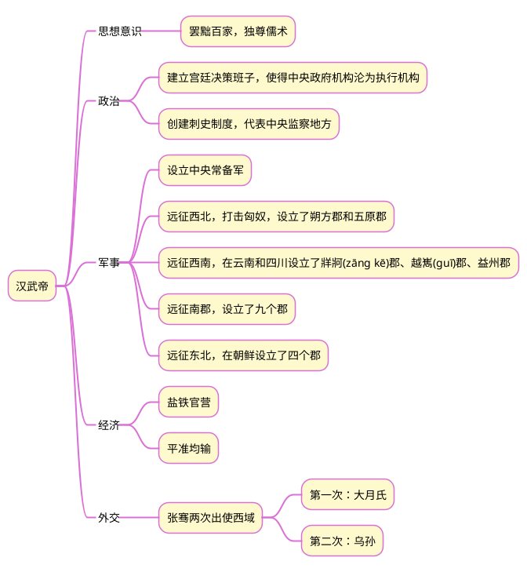

# 《国史十六讲(修订版)》读书笔记之四

## 1 思维导图
### 1.1 秦

### 1.2 汉武帝

## 2 笔记
### 2.1 关键词
1.  “罢黜百家，独尊儒术“
2.  “三纲“与“五常”
### 2.2 笔记摘录
1. 汉武帝“罢黜百家，独尊儒术”以来，儒学成为五经博士研究与教授的经学。
2. 经学特殊地位的确立，显示儒学的官学化得以确立，成为“学而优则仕”的工具。
3. 通晓经学，就意味着打开了通向高官厚禄的门径。
4. “三纲”：君为臣纲、父为子纲、夫为妻纲。
5. “五常”：仁、义、礼、智、信
### 2.3 相关问题
1. 公元前221年秦朝统一中国，到公元前206年秦王子婴向刘邦投降，秦朝灭亡，时间只有15年。秦朝灭亡的原因主要有：
>- 秦朝统一后，不仅没有修养生息，反而大兴土木，修建长城、阿房宫、秦皇陵等，使得民不聊生。
>- 秦朝统一后，虽然灭亡了六国，但没有清除这些国家的残余势力，当发生农民起义时，这些残余势力纷纷响应。
>- 秦朝统一后，精锐军队一部分部署在北方边境，防御匈奴，另一部分征讨南郡，导致内部军事力量空虚，无力镇压起义军。
>- 秦朝统一后，没有及时确定继承人，导致秦始皇暴亡后，政权交接混乱，继承人不佳。
2. 汉武帝“独尊儒术”的原因？
   汉初，奉行黄老思想，实行“无为而治”，但不适合帝国的中央集权。随着国力的增强，汉武帝“大有作为”的时代，需要加强中央集权，黄老思想已经不合时宜。而儒家学说的“大一统”思想，即政治的大一统、意识形态的大一统、儒家学说的大一统，非常契合中央集权的理念。

{}秦、汉帝国都想用政权的力量控制意识形态，秦始皇采用“焚书坑儒”的手段，没有成功。汉武帝用功名利禄来引诱士人——只有精通儒家经学才可以进入仕途，终于达到了目的，为后来很多治国者所继承。

 {}

%}}

