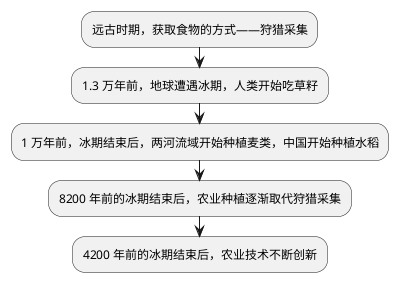
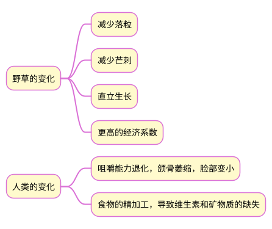

>《谷物的故事》读书笔记

## 1 吃草籽，人类被动的选择

## 2 野草变谷物的驯化之路

## 3 谷物的资源
| 谷物名称 | 起源地                | 目前最大产地 |
| -------- | --------------------- | ------------ |
| 稻米     | 粳稻：中国，籼稻:印度 | 中国         |
| 小麦     | 两河流域              | 中国         |
| 玉米     | 墨西哥                | 美国         |
| 大豆     | 中国                  | 美国         |
| 土豆     | 秘鲁                  | 中国             |

## 4 小麦和稻米

### 4.1 种植
#### 4.1.1 小麦
小麦是旱作谷物，而欧洲夏季气候干旱，适合小麦的生长。小麦的种植方式简单粗放，造就了欧洲人的性格。

#### 4.1.2 稻米
稻米的祖先生长在热带沼泽里，而东亚、南亚是季风气候区，雨热同季，适合水稻的生长。水稻需要精细管理，育苗、插秧、控水，造就了中国南方人的性格。同时，由于稻田根系在水下，缺氧，呼吸过程中产生甲烷，而甲烷的温室效应是二氧化碳的120倍，影响气候变暖。

### 4.2 食用
#### 4.2.1 小麦
在小麦的起源地——西亚，当小麦出现的时候，陶器还未出现，主要使用石器，因此只有炙烤，即面包。面包经过高温消毒，含水量低，易于携带和储藏，适应西方人流动的生活状态。

#### 4.2.2 稻米
在中国，陶器的出现早于谷物的种植，因此收获的谷粒放在陶器里蒸煮，就成为主要的食用方式，适应中华民族安土重迁的农耕文明。这种食用方式直接导致筷子的出现。

### 4.3 营养
1. 从含量和质量上来说：含量上小麦比米多一些，但是质量上，却是小麦比米差一些。因为，小麦中含有40%的“醇溶谷蛋白”，但其中严重缺乏人体必需氨基酸——赖氨酸；而米中“醇溶谷蛋白”的含量低于20%，但是米蛋白的生物价值高且在常见的谷类中是比较高如此。
2. 从维生素上来说：小麦中含有较多的维生素B1；而稻米中维生素B1的含量只有小麦的一半左右，精白处理后含量更低。
3. 从矿物质的含量来说：小麦在钙、磷、钾、镁几个项目上都占有明显的优势，而稻米在锌、铜、锰等项目上更胜一筹。

总的来说，稻米和小麦的营养价值基本相当。
