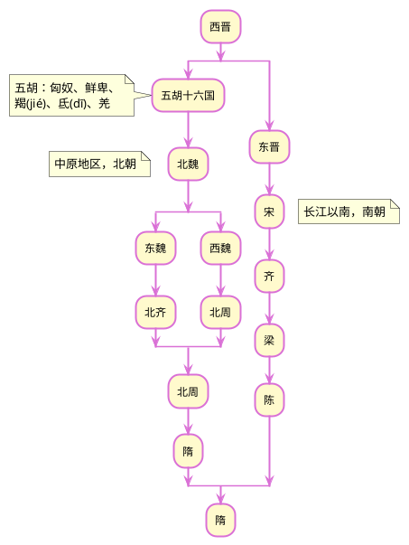
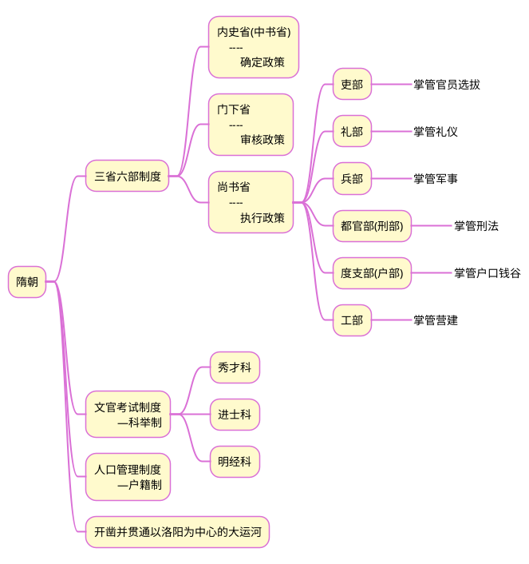

## 1 思维导图
### 1.1 朝代更迭示意

### 1.2 隋朝的创制

## 2 笔记
### 2.1 关键词
>门阀

### 2.2 笔记摘录

- 所谓门阀，有门与阀两层意思，门即门第、门户，阀即阀阅，门阀即门第等级。
- 当时又有“门地”之说，地指地望，即宗族的籍贯。以地望别姓氏，以地望别贵族，是当时社会等级结构的一个外部特征。
- 东晋主要氏族：琅琊王氏、颍川庾氏、谯国桓氏、陈郡谢氏、太原王氏

### 2.3 相关问题：
>隋朝为什么会迅速灭亡？

隋朝于公元581年建立，589年统一南北，618年灭亡。灭亡的原因主要有：

1. 隋朝的建立，并未打破原有势力格局，大族世家依然把持政权。而科举制的改革，触犯了他们的利益。
2. 隋朝统一后，原本应该休养生息，但是修建大运河，劳民伤财。
3. 劳师远征高句丽，穷兵黩武。

  这一时期，是一个大分裂大动乱时期，也是一个由分裂走向统一的时期。各民族在融合中求同存异，胡人汉化，汉人胡华，最终由隋实现了统一。该时期与春秋战国时期有点类似，都是由统一到分裂，再到统一。

 
